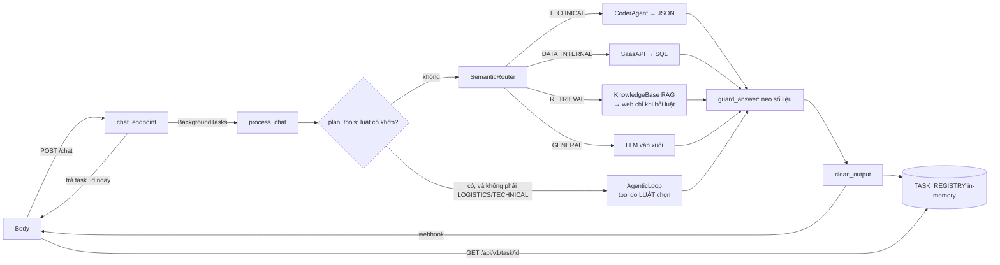
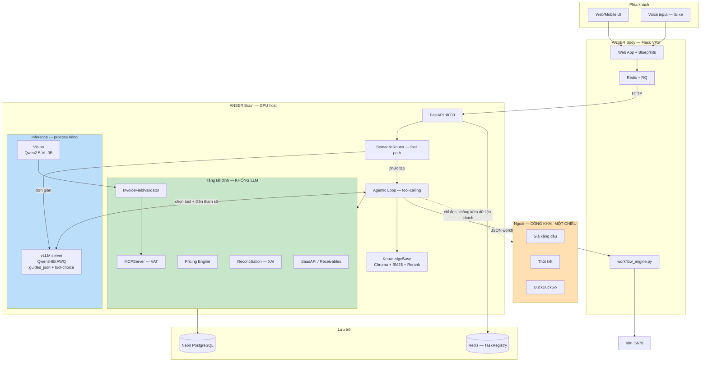
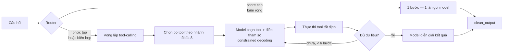
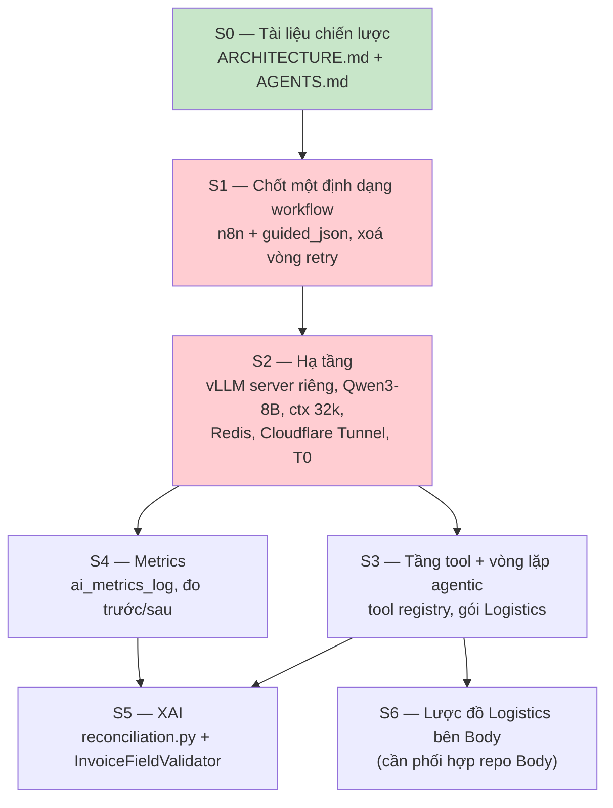

# ARCHITECTURE.md — ANSER Brain

> **Phiên bản:** 2.0
> **Ngày:** 27/07/2026
> **Thay thế:** v1.0 (08/05/2026) và `ANSER_AI_SPEC.md` v1.0 (23/06/2026)
> **Phạm vi:** Repo `AI_ANSER` (module Brain). Repo Body (Flask/VPS/Neon) nằm ngoài phạm vi sửa đổi nhưng là ràng buộc tích hợp.

> 📐 **Hình vẽ ở [ARCHITECTURE_DIAGRAMS.md](ARCHITECTURE_DIAGRAMS.md)** — C4 mức
> 1→3, sơ đồ tuần tự cho ba luồng chính, phụ thuộc giữa các module, và ngân sách
> VRAM. Tách file vì tài liệu này đã dài; **quyết định kiến trúc vẫn nằm ở đây**,
> file kia chỉ vẽ lại cho dễ nhìn.

---

## 0. Vì sao có bản 2.0 — 5 thay đổi chiến lược

| # | v1.0 giả định | v2.0 chốt lại | Lý do |
|---|---|---|---|
| 1 | Runtime = Google Colab Pro (L4 22.5GB) | **GPU cloud thuê, hardware-neutral** | Điều khoản Colab Paid cấm *"web service offering not related to interactive compute"*. Kiến trúc FastAPI + ngrok 24/7 vi phạm trực tiếp → rủi ro khóa tài khoản giữa lúc demo |
| 2 | Nghiệp vụ chính = bán lẻ, giai đoạn 2 = sản xuất A-B-C | **Nghiệp vụ chính = logistics/báo giá vận tải** | Khách pilot thực tế là doanh nghiệp trung gian vận tải. Bán lẻ giữ lại vì code đã có, nhưng không còn là ưu tiên 1 |
| 3 | Ngân sách hạ tầng không nêu rõ | **≤ 5.000.000đ/tháng cho pilot miễn phí; thấp hơn càng tốt.** Khách trả phí sau → hạ tầng scale theo doanh thu khách đó | Ràng buộc cứng do chủ dự án đặt |
| 4 | Không nêu ranh giới dữ liệu | **Toàn bộ LLM chạy local. Không có dữ liệu khách hàng nào rời hạ tầng** | Bảng giá cước + tỷ lệ biên là bí mật kinh doanh cốt lõi của khách logistics |
| 5 | Agentic = router 1 bước + 1 lần gọi model | **Agentic = vòng lặp tool-calling trên tầng tool tất định** | Độ rộng nghiệp vụ đến từ số lượng tool, không từ kích thước model |

---

## 1. Năm nguyên tắc kiến trúc bất biến

Mọi quyết định kỹ thuật trong repo này phải kiểm chứng được ngược lại 5 nguyên tắc sau. Nếu một đề xuất vi phạm bất kỳ nguyên tắc nào, đề xuất đó sai — không phải nguyên tắc sai.

### P1 — Deterministic-first
**LLM không bao giờ là nguồn tính toán cuối cùng.** LLM chỉ làm 2 việc: (a) chuyển ngôn ngữ tự nhiên → cấu trúc có schema, và (b) diễn giải cấu trúc → ngôn ngữ tự nhiên. Mọi phép tính số học, mọi truy vấn dữ liệu, mọi quyết định ghi DB đều nằm trong code Python thuần kiểm thử được.

*Hiện thân trong code:* [`mcp_server.py`](src/core/mcp_server.py) (VAT theo NĐ 72/2024), [`tools.py`](src/core/tools.py) (safe math bằng `ast.parse`).

### P2 — Chủ quyền dữ liệu tuyệt đối
**Không một byte dữ liệu khách hàng nào được gửi tới LLM bên thứ ba.** Bao gồm: tồn kho, doanh thu, công nợ, bảng giá cước, tỷ lệ biên, danh sách khách, nội dung hóa đơn.

Ngoại lệ duy nhất — các nguồn công khai **một chiều, chỉ đọc**, không kèm dữ liệu khách trong request: giá xăng dầu, thời tiết, tỷ giá, tìm kiếm web.

*Hệ quả:* vòng lặp agentic nạp lại kết quả tool vào context ở mỗi bước — kết quả tool *chính là* dữ liệu khách. Vì vậy vòng lặp agentic **bắt buộc chạy local**.

### P3 — Ngân sách là ràng buộc thiết kế, không phải hệ quả
Hạ tầng phục vụ pilot miễn phí phải ≤ 5tr/tháng. Mọi lựa chọn model, context length, batch size được tính ngược từ con số này. Khi có khách trả phí, hạ tầng được phép tăng theo tỷ lệ doanh thu khách đó mang lại (xem §4.3).

### P4 — Một định dạng, một nguồn sự thật
Mỗi khái niệm chỉ được định nghĩa ở đúng một chỗ: một định dạng workflow, một lược đồ DB, một bộ prompt. Trùng lặp định nghĩa là nguồn gốc của lỗi tốn kém nhất trong repo này (xem §11).

### P5 — Hardware-neutral
Code không được giả định một GPU cụ thể. Mọi tham số phần cứng (model id, VRAM budget, context length, quantization) đọc từ biến môi trường. Chuyển từ GPU thuê sang máy tự sở hữu phải chỉ là đổi `.env`, không sửa code.

---

## 2. Hiện trạng đã kiểm chứng (audit 27/07/2026)

> Toàn bộ mục này đọc trực tiếp từ code. **Không kế thừa mô tả từ tài liệu cũ** — v1.0 và spec v1.0 đều mô tả sai hiện trạng ở nhiều điểm.

### 2.1. Những gì tài liệu cũ nói sai

| Tài liệu cũ | Thực tế trong code |
|---|---|
| `src/server.py` monolith 470 dòng | **Không tồn tại.** Đã tách thành [`src/api/main.py`](src/api/main.py) + [`routes/`](src/api/routes/) |
| Vision = Florence-2 | Qwen2-VL-2B-Instruct, [`engine.py:111`](src/core/engine.py#L111) |
| Text model = `Qwen2.5-Coder-32B-AWQ` | `anser-retail-v2-awq` (7B fine-tune), [`config.py:55`](src/core/config.py#L55) |
| Hạ tầng A100 80GB | Config tính cho L4 22.5GB |
| Có nhánh `FINANCIAL` trong router | Đã gỡ; validate hóa đơn đi qua `/ocr` |
| `max_model_len` = 8192 | 4096, [`config.py:80`](src/core/config.py#L80) |

### 2.2. Cấu trúc thực tế

```
src/
├── api/
│   ├── main.py            # app factory, lifespan, CORS, middleware request-id
│   ├── dependencies.py    # RuntimeState (lazy-load + async lock), auth, clean_output
│   └── routes/
│       ├── chat.py        # POST /chat  — vòng agentic (tool do luật chọn) + 6 nhánh router
│       ├── knowledge.py   # POST/GET/DELETE /knowledge/documents, POST /knowledge/search
│       ├── tools.py       # /tools/* tất định + manifest + MCP bọc REST
│       └── documents.py   # POST /upload, /ocr
├── agents/
│   ├── base.py            # proxy → ModelEngine
│   ├── manager.py         # SemanticRouter (keyword → cosine → margin) + ManagerAgent
│   ├── coder.py           # sinh JSON workflow
│   ├── vision.py          # lớp mỏng trên engine.generate_vision()
│   └── researcher.py      # DuckDuckGo + tóm tắt
├── core/
│   ├── engine.py          # ModelEngine singleton (vLLM + Qwen2-VL), TaskRegistry
│   ├── config.py          # model id, vLLM params, DB url
│   ├── knowledge.py       # Chroma + BM25Okapi + CrossEncoder + underthesea
│   ├── mcp_server.py      # VAT NĐ 72/2024 — code thuần, không LLM
│   ├── memory.py          # SQLAlchemy → DB của Body
│   ├── saas_api.py        # truy vấn products/sales
│   ├── prompts.py         # nguồn duy nhất cho system prompt
│   ├── agent_middleware.py# danh mục node workflow đưa vào prompt CoderAgent
│   ├── schemas.py, utils.py, context.py, integrations.py, external_data.py
│   └── archive/           # công cụ cũ, không nằm trong luồng chạy
└── data/
    ├── docs/              # 43MB tài liệu luật thuế + báo cáo ngành (nguồn RAG)
    └── blueprints/        # 6 workflow mẫu — ⚠️ định dạng Make.com, xem §11
offline_training/          # legal_miner, distill DeepSeek-R1, merge_all, train_v2 (LoRA r=64)
tests/                     # 4 file: server, server_basics, memory_contracts, tools
```

### 2.3. Luồng chạy hiện tại



### 2.4. Điểm mạnh giữ nguyên

1. **Deterministic-first đã có nền** — `mcp_server.py` là mẫu đúng để mở rộng.
2. **RAG tiếng Việt xử lý đúng đặc thù** — `underthesea` tokenize từ ghép + dấu, hybrid dense/lexical + rerank. Không cần sửa.
3. **Router 3 lớp có kỷ luật** — keyword override → cosine → kiểm tra biên; biên hẹp thì hạ về GENERAL thay vì đoán bừa ([`manager.py:212-233`](src/agents/manager.py#L212-L233)). Giữ làm fast path.
4. **Embedder dùng chung** — `SemanticRouter(embedder=kb.embedder)` tránh nạp MiniLM 2 lần lên VRAM.
5. **Tách Brain/Body qua HTTP** — cho phép Brain đổi hạ tầng mà Body không đổi dòng nào.

---

## 3. Nghiệp vụ mục tiêu — Logistics / báo giá vận tải

### 3.1. Mô tả từ khảo sát khách hàng

Doanh nghiệp 4-5 người, hoạt động **trung gian logistics**: nhận yêu cầu vận chuyển từ khách → hỏi giá nhà xe → cộng biên → báo giá lại khách.

Đặc thù ghi nhận được:

- Gọi xe ngoài theo tải trọng: 1.5T, 3T, 5T, đầu kéo. Bãi xe: Lĩnh Nam, Lưu Hữu Phước.
- Tuyến ví dụ: Hữu Nghị → Hải Phòng / Bắc Giang / Bắc Ninh.
- **Giá cước biến động hàng ngày theo giá xăng dầu** (dẫn chứng: dầu 25.000đ → 28.000đ).
- Không có xe nhà → gọi shipper ngoài, yêu cầu **chụp ảnh xác nhận bàn giao + số tài khoản** để thanh toán.
- Chủ doanh nghiệp làm việc của 3-4 người: công nợ, báo giá, tồn kho, đối chiếu giá nhập xuất.
- **Đang lái xe thì không báo giá được** — phải về văn phòng mới xử lý.
- Có kho lạnh, xuất theo ngày, đối chiếu tồn kho theo hóa đơn thực tế.
- Phân cấp kho: thủ kho nhập liệu → người khác đối chiếu hóa đơn chứng từ → xác nhận.
- Đang thuê **MISA** cho kế toán/xuất hóa đơn/xuất nhập tồn. MISA không có quản lý nhân sự, và **vẫn bắt người dùng tự tính toán bên ngoài rồi nhập tay từng bước**.

### 3.2. Điểm chèn AI — bám sát P1

| # | Nghiệp vụ | LLM làm gì | Code tất định làm gì |
|---|---|---|---|
| L1 | **Lập báo giá** | Trích xuất `{origin, destination, tonnage, cargo_type, pickup_date}` từ câu tiếng Việt tự do | Tra bảng giá nhà xe → áp hệ số nhiên liệu → áp biên → dựng báo giá |
| L2 | **Gửi báo giá** | Viết nội dung email tiếng Việt | Render template, gửi, ghi log |
| L3 | **Công nợ** | Hiểu câu hỏi → chọn tool + tham số; diễn giải kết quả | Truy vấn `receivables`, tính quá hạn |
| L4 | **OCR hóa đơn** | VLM trích xuất trường | `InvoiceFieldValidator` + `MCPServer` tính lại toàn bộ số học |
| L5 | **Đối soát chênh lệch (XAI)** | Diễn giải struct chênh lệch thành tiếng Việt | Quy nguyên nhân về từng nhóm kèm bằng chứng — xem §8 |
| L6 | **Theo dõi chuyến / thanh toán shipper** | Diễn giải trạng thái | Ghi `trips`, `shipper_payments`, đính kèm ảnh bằng chứng |
| L7 | **Sinh workflow tự động hóa** | Sinh JSON theo schema ràng buộc | Validate schema, deploy sang n8n |

**Quan sát then chốt:** ở mọi dòng, cột "LLM làm gì" đều là tác vụ **trích xuất hoặc diễn giải** — không có ô nào yêu cầu suy luận nhiều bước phức tạp. Đây là lý do một model 8B đủ dùng, và là cơ sở kỹ thuật để đáp ứng ràng buộc P3.

### 3.3. Khác biệt cạnh tranh với MISA

MISA mạnh về kế toán/kho nhưng bắt người dùng **tự tính toán bên ngoài rồi nhập tay**. ANSER không cạnh tranh với MISA ở sổ sách — ANSER thay thế **phần "tự tính toán bên ngoài"**: nhận yêu cầu bằng ngôn ngữ tự nhiên (kể cả khi đang lái xe), tính ra con số, và tự động hóa bước nhập liệu.

---

## 4. Chiến lược hạ tầng

### 4.1. Nguyên tắc: thuê trước, sở hữu sau

Giai đoạn hiện tại thuê GPU cloud vì chưa có vốn cố định. Khi dòng tiền ổn định → chuyển sang máy tự sở hữu. **P5 (hardware-neutral) tồn tại chính là để bước chuyển này không tốn công viết lại code.**

### 4.2. Bậc hạ tầng gắn với doanh thu

Tỷ giá tham chiếu: **26.000đ/USD**.

| Bậc | Khi nào | Cấu hình | Chi phí/tháng | Ghi chú |
|---|---|---|---|---|
| **T0** | Pilot miễn phí (hiện tại) | RTX 3090 24GB, **bật theo giờ hành chính** (~10h × 22 ngày = 220h) | ~$29 ≈ **750.000đ** | Khách là DN 4-5 người làm giờ hành chính. Job đêm chạy bằng n8n thuần, không cần GPU |
| **T1** | 1-3 khách trả phí | RTX 3090 24GB **24/7** | ~$95 ≈ **2.500.000đ** | Vẫn dưới trần 5tr |
| **T2** | 5-10 khách trả phí | RTX 4090 24GB 24/7 hoặc 2× 3090 | ~$241 ≈ **6.300.000đ** | Doanh thu lúc này 75-150tr/tháng → hạ tầng chiếm 4-8% |
| **T3** | Dòng tiền ổn định | **Máy tự sở hữu** RTX 3090/4090 24GB | ~15-18tr một lần + **~600.000đ điện/tháng** | Hoàn vốn ~6-7 tháng so với T1. Chủ quyền dữ liệu tuyệt đối |

**Bậc T0 là mục tiêu triển khai ngay.** 750k/tháng = 15% trần cho phép — thỏa yêu cầu "thấp hơn càng tốt".

### 4.3. Cảnh báo về chủ quyền dữ liệu khi thuê GPU

Đây là điểm phải ghi rõ để không tự lừa mình:

> **GPU thuê trên marketplace cộng đồng (Vast.ai) là máy của người lạ.** Weights và dữ liệu nằm trong VRAM/RAM/disk của họ, không có hợp đồng bảo mật. Xét thuần về chủ quyền dữ liệu, mức bảo vệ này *thấp hơn* API thương mại có điều khoản zero-retention.

Vì vậy trong giai đoạn T0/T1, P2 chỉ được thỏa mãn **một phần**. Biện pháp giảm thiểu bắt buộc:

1. Ưu tiên nhà cung cấp có datacenter riêng (RunPod Secure Cloud) hơn marketplace cộng đồng, nếu giá cho phép.
2. **Không** để dữ liệu khách nằm lại trên đĩa GPU host: DB ở Neon, vector store đồng bộ từ Body, log đẩy về Body theo lô.
3. Mã hóa toàn bộ kênh Brain ↔ Body; xoay API token định kỳ.
4. **T3 (máy tự sở hữu) là điều kiện để tuyên bố P2 đầy đủ với khách hàng.** Không quảng cáo "dữ liệu không rời hệ thống" trước khi đạt T3.

### 4.4. Loại bỏ Colab khỏi lộ trình production

Điều khoản Colab Paid Services cấm *"file hosting, media serving, or other web service offering not related to interactive compute with the Paid Service"*. FastAPI + ngrok phục vụ Body liên tục rơi đúng vào định nghĩa này.

Colab **chỉ** được dùng cho: fine-tune, quantize, thử nghiệm rời rạc. **Không** phục vụ traffic thật.

---

## 5. Chiến lược model

### 5.1. Bảng chọn model

Toàn bộ chạy local, không có API bên ngoài (P2).

| Vai trò | Model | Định dạng | VRAM |
|---|---|---|---|
| **Agentic brain** — tool-calling, chat, XAI narration, sinh workflow | `Qwen3-8B-Instruct` | AWQ 4-bit | ~5,5 GB |
| KV-cache @ ctx 32k, batch vừa | — | — | ~5,0 GB |
| **Vision** — OCR hóa đơn | `Qwen2.5-VL-3B-Instruct` | AWQ 4-bit | ~3,0 GB |
| **Embedding** | `paraphrase-multilingual-MiniLM-L12-v2` | FP16 | ~0,5 GB |
| **Reranker** | `ms-marco-MiniLM-L-6-v2` | FP16 | ~0,3 GB |
| Đệm | — | — | ~0,7 GB |
| **TỔNG** | | | **~15,0 GB** |

Vừa card 16GB, dư thoải mái trên 3090/4090 24GB.

### 5.2. Vì sao 8B — và vì sao *không* to hơn

**Không phải vì tiết kiệm.** Vì §3.2 cho thấy LLM chỉ làm 2 việc: trích xuất có schema và diễn giải. Với constrained decoding, đó là tác vụ mà 8B thực hiện ổn định.

| Cân nhắc | Kết luận |
|---|---|
| `Qwen3-30B-A3B` (MoE, 3B active) | ❌ Cần ~19-21GB ở Q4 → **không còn chỗ cho vision**. OCR hóa đơn là tính năng cốt lõi, không đánh đổi được |
| `Qwen3-14B` AWQ (~9GB) | ⚠️ Vừa 24GB nhưng không vừa 16GB → khóa chặt vào bậc T1+. Để dành khi lên T2 |
| **`Qwen3-8B` AWQ** | ✅ Tool-calling gốc, ctx 32k, vừa mọi bậc từ T0 đến T3 |
| `Qwen2.5-7B` (hiện tại) | Vẫn dùng được, nhưng Qwen3 mạnh hơn rõ rệt ở tool-calling — đúng năng lực ta cần nhất |

### 5.3. Fine-tune: v2 nghỉ hưu, v3 là pipeline hiện hành (27/07/2026)

Model v2 (`anser-retail-v2-awq`, LoRA r=64 trên Qwen2.5-7B, distill DeepSeek-R1) **không dùng lại** — không phải vì code tệ mà vì dữ liệu dạy ngược kiến trúc mới: system prompt cũ ("Project A"), ép `<think>` ở mọi câu trả lời (xung đột trực tiếp với guided_json — grammar ép `{` là token đầu), 24 mẫu Make.com, hợp đồng action-JSON đã bỏ, và loss tính trên cả prompt.

**Ba quyết định của chủ dự án (27/07/2026):**

1. **Model gốc = `Qwen/Qwen3-8B`** (khớp bảng chọn §5.1 — tool-calling gốc).
2. **5 file nguồn v2 còn trên Drive** → khôi phục vào [`offline_training/v2_sources/`](offline_training/v2_sources/), convert lại rồi commit (đóng bug #4 §11.5).
3. **Dataset v3 bỏ hẳn `<think>`** — nhánh JSON không thể think dưới grammar; nhánh tư vấn dựa vào thinking mode gốc của Qwen3 (bật/tắt từng request; engine hiện render `enable_thinking=False`).

**Pipeline v3** ([`offline_training/README.md`](offline_training/README.md)): guided decoding đã gánh phần cú pháp nên fine-tune chỉ dạy **ngữ nghĩa**. Điểm thiết kế chính:

| Nguồn data | Cách sinh | Vì sao đáng tin |
|---|---|---|
| Trích xuất báo giá | **Reverse-generation**: sinh JSON ground truth tất định trước, teacher (deepseek-chat) chỉ viết tin nhắn tự nhiên chứa đúng thông tin đó, verify tất định sau | Nhãn đúng tuyệt đối theo cấu trúc — không phải tin teacher |
| Diễn giải XAI | Số do `compute_quote`/`select_carrier` **thật** tính trên kịch bản hư cấu; teacher viết lời; chốt chặn "mọi số ≥4 chữ số phải có trong context" + quét từ lộ biên | P1 + P2 được ép bằng code, không bằng lời dặn |
| Sinh workflow n8n | Đáp án = 30 template **đang chạy thật** (Body + logistics) qua `validate_workflow()`, node bị chặn thay `noOp` | Khác hẳn module_c cũ để teacher tự bịa n8n JSON |
| Tư vấn bán lẻ | Convert v2: bỏ think, đổi system prompt về `Prompts.GENERAL_SYSTEM`, chặn Make.com/SQL cũ, quét secret (R2b), downsample ≤55% tập | Không cho data cũ lấn át tín hiệu logistics |

`train_v3.py` bỏ trl (API trôi làm gãy script), loss chỉ trên phần trả lời, eval split + best-checkpoint, tự nhận bf16/fp16. `merge_and_quantize.py` đóng lỗ hổng "bước AWQ không tái tạo được". `benchmark_v3.py` là cổng chặn: **đo baseline Qwen3-8B gốc trước khi tốn tiền distill** — con số baseline quyết định fine-tune cần cứu bao nhiêu điểm.

### 5.4. Serving — sửa nút thắt lớn nhất

[`engine.py:97`](src/core/engine.py#L97) dùng `vllm.LLM` — đây là **offline batch API**, không phải `AsyncLLMEngine`. [`engine.py:145`](src/core/engine.py#L145) gọi nó qua `run_in_executor(None, ...)`, tức nhiều thread cùng gọi một object không thread-safe.

**Hệ quả: continuous batching của vLLM bị vô hiệu hoàn toàn.** Request xếp hàng tuần tự thay vì batch song song. Đây là nguyên nhân trực tiếp của hiện tượng "quá tải, treo".

**Kiến trúc mục tiêu:** vLLM chạy **process riêng** ở chế độ OpenAI-compatible server; Brain gọi qua HTTP nội bộ.

| Lợi ích | Chi tiết |
|---|---|
| Continuous batching thật | Throughput tăng nhiều lần ở cùng phần cứng |
| Restart API không nạp lại model | Hiện tại restart = chờ vài phút nạp weights |
| Guided decoding sẵn có | `guided_json`, `--enable-auto-tool-choice --tool-call-parser hermes` |
| Tách vòng đời vision | Vision service riêng, bật/tắt độc lập |

Đồng thời: `enforce_eager=True` ([`config.py:83`](src/core/config.py#L83)) tắt CUDA graphs → mất 15-25% tốc độ decode. Bug này đặc thù vLLM cũ + L4 + Colab; trên phần cứng mới với vLLM hiện hành phải **test lại và bật nếu được**.

---

## 6. Kiến trúc mục tiêu



**Ranh giới P2 nằm ở đúng một chỗ:** mũi tên đứt nét đi ra `ext`. Chỉ các tool đọc dữ liệu công khai được phép vượt qua, và chúng không mang theo tham số nào chứa dữ liệu khách.

---

## 7. Tầng tool tất định — nơi độ rộng nghiệp vụ thực sự nằm

> **Trạng thái 27/07/2026 — đã triển khai đợt đầu.** Quyết định chốt: *"tính ở Brain, DB ở rag_service"* — mọi endpoint `/tools/*` của Brain là **hàm thuần qua HTTP** (stateless, dữ liệu vào trong body, không đọc DB, không LLM); phần chở dữ liệu do n8n/agentic lo, khớp đúng mẫu `rag_service:8001` của đội (§11.7).
>
> Đã có ([`src/api/routes/tools.py`](src/api/routes/tools.py)): `POST /tools/quote` (engine [`pricing.py`](src/core/pricing.py) — điều chỉnh nhiên liệu + biên + phụ phí, tách `quote` đưa khách cuối / `internal` có biên theo P2), `POST /tools/carrier-selection`, `POST /tools/forecast-reorder` (bản nâng cấp Croston/SBA của rag_service `/forecast-reorder` — workflow chỉ cần đổi env var để chuyển), `POST /tools/vat`, và `GET /tools` trả manifest kèm JSON Schema — nguồn duy nhất cho agentic tool-calling và lớp MCP bọc sau (P4).
>
> Nhập liệu pilot: bộ Google Sheet mẫu tại [`data/sheet_templates/`](data/sheet_templates/) (Carriers, Routes, CarrierQuotes, PricingRules ⚠️, FuelIndex). Kênh đầu ra: **email** cho khách cuối (theo bản ghi), **Zalo** cho chủ doanh nghiệp (tái dùng `NOTIFY_URL` như `retail_debt_reminder`).

> **"Agentic phải làm được rất nhiều việc" được hiện thực bằng số lượng tool, không bằng kích thước model.**
> Mỗi tool là một hàm Python có schema đầu vào/ra rõ ràng, kiểm thử được, không gọi LLM.

### 7.1. Gói Logistics (ưu tiên 1)

| Tool | Chữ ký | Ghi chú |
|---|---|---|
| `lookup_carrier_price` | `(origin, destination, vehicle_type) → [{carrier, price, valid_to}]` | Tra `carrier_quotes` |
| `get_fuel_price` | `(fuel_type, date) → {price, source, effective_date}` | **Nguồn công khai** |
| `compute_quote` | `(carrier_cost, fuel_index, pricing_rule) → {cost, fuel_adj, margin, final}` | Thuần số học, kiểm thử được |
| `create_quote` | `(customer, route, vehicle, cargo, date, price) → quote_id` | Ghi DB |
| `send_quote_email` | `(quote_id, to) → {sent_at}` | Render template |
| `list_receivables` | `(customer_id?, overdue_only?) → [...]` | Công nợ |
| `record_trip` | `(quote_id, carrier, driver, plate) → trip_id` | |
| `attach_delivery_proof` | `(trip_id, image_url) → ok` | Ảnh shipper chụp |
| `create_shipper_payment` | `(trip_id, amount, bank_account) → payment_id` | **Chỉ tạo, không tự duyệt chi** |

### 7.2. Gói Kho & Kế toán (dùng chung, đã có một phần)

| Tool | Trạng thái |
|---|---|
| `get_inventory` / `get_sales_report` | ✅ [`saas_api.py`](src/core/saas_api.py) |
| `calculate_vat` / `validate_invoice_total` | ✅ [`mcp_server.py`](src/core/mcp_server.py) |
| `ocr_invoice` | ✅ [`documents.py`](src/api/routes/documents.py) |
| `validate_invoice_fields` | ❌ **Chưa có** — xem §11.2 |
| `reconcile_stock` | ❌ **Chưa có** — xem §8 |
| `search_docs` | ✅ [`knowledge.py`](src/core/knowledge.py) |
| `create_workflow` | ⚠️ Có nhưng hỏng — xem §11.1 |

### 7.3. Quy tắc thiết kế tool

1. **Mỗi tool tự validate đầu vào.** Không tin tham số model điền.
2. **Tool ghi dữ liệu không bao giờ tự động duyệt.** Mọi thứ chạm tiền hoặc sổ sách tạo bản ghi `pending_review`.
3. **Không lộ hơn 8 tool cho model cùng lúc.** Router thu hẹp bộ tool theo nhánh — vừa tăng độ chính xác chọn tool, vừa giảm token.
4. **Tool đọc nguồn ngoài không nhận tham số chứa dữ liệu khách** (P2).

---

## 8. Tầng XAI — trả lời "vì sao chênh lệch"

Yêu cầu gốc từ khách: *"giải đáp được vì sao chênh lệch"*.

**Cách làm sai:** đưa hai bảng số cho LLM và hỏi "tại sao khác nhau". LLM sẽ bịa một lời giải thích trôi chảy. Model to hơn chỉ bịa trôi chảy hơn.

**Cách làm đúng:** module `src/core/reconciliation.py` (chưa có) — code tất định quy chênh lệch về từng nhóm nguyên nhân **kèm bằng chứng truy vết được**:

```
Đầu vào : tồn kho lý thuyết  vs  tồn kho đếm thực tế (hoặc hóa đơn thực tế)
Xử lý   : phân rã chênh lệch thành các nhóm
          ├─ thiếu phiếu nhập      → có xuất, không có nhập tương ứng  [id phiếu]
          ├─ OCR đọc sai           → lệch khớp mẫu lỗi chữ số điển hình [id dòng HĐ]
          ├─ giá thay đổi giữa kỳ  → khớp số lượng, lệch thành tiền     [id lần đổi giá]
          ├─ chưa đối chiếu        → thủ kho đã nhập, chưa ai xác nhận  [id bản ghi]
          └─ hao hụt / chưa rõ     → phần dư
Đầu ra  : struct {tổng chênh, các nhóm, bằng chứng, độ tin cậy}
```

LLM chỉ nhận struct đó và viết thành tiếng Việt cho chủ doanh nghiệp. **Mỗi câu trong lời giải thích trỏ ngược về một id bản ghi cụ thể.** Đó mới là XAI — giải thích kiểm chứng được, không phải giải thích nghe hợp lý.

Nhóm "chưa đối chiếu" ánh xạ trực tiếp quy trình khách mô tả: thủ kho nhập → người khác đối chiếu hóa đơn chứng từ → xác nhận.

---

## 9. Vòng lặp Agentic

### 9.1. Hai đường — nhanh và đầy đủ

Giữ [`SemanticRouter`](src/agents/manager.py#L70) làm **fast path**. Câu hỏi đơn giản, điểm cao, biên rộng → trả lời 1 bước như hiện tại (nhanh, ít token). Chỉ câu phức tạp mới vào vòng lặp tool-calling.



### 9.2. Ràng buộc cứng

| Ràng buộc | Giá trị | Lý do |
|---|---|---|
| Số bước tối đa | 6 | Chặn vòng lặp vô hạn |
| Timeout toàn vòng | 60s | Trải nghiệm người dùng |
| Số tool lộ ra mỗi lượt | ≤ 8 | Độ chính xác chọn tool + tiết kiệm token |
| Định dạng tool call | Constrained decoding | Lỗi định dạng trở thành **bất khả thi**, không phải "hy vọng đúng rồi retry" |
| Tool ghi dữ liệu | `pending_review` | Không tự động duyệt bất cứ thứ gì chạm tiền |

### 9.3. Vì sao cần ctx 32k

Vòng lặp nạp lại kết quả tool ở mỗi bước. Với `max_model_len=4096` hiện tại, context tràn sau khoảng 3 tool call có kèm RAG chunk. **32k là điều kiện cần, không phải tối ưu hóa.**

---

## 10. Mô hình dữ liệu Logistics (bảng mới, thuộc Body)

[`db_schema.txt`](offline_training/db_schema.txt) hiện chỉ có bảng bán lẻ. Nghiệp vụ logistics cần bổ sung:

```sql
carriers(id, workspace_id, name, phone, depot, bank_account, notes, is_active)
vehicle_types(id, code, name, capacity_tons)                    -- 1.5T, 3T, 5T, đầu kéo
routes(id, workspace_id, origin, destination, distance_km, notes)
carrier_quotes(id, carrier_id, route_id, vehicle_type_id, price,
               valid_from, valid_to, source, created_at)        -- giá nhà xe báo
fuel_index(id, fuel_type, price, effective_date, source)        -- giá dầu theo ngày
pricing_rules(id, workspace_id, name, base_margin_pct,
              fuel_sensitivity, min_margin, surcharges_json)    -- ⚠️ BÍ MẬT KINH DOANH
customer_quotes(id, workspace_id, customer_id, route_id, vehicle_type_id,
                cargo_type, pickup_date, carrier_cost, fuel_adjustment,
                margin_amount, quoted_price, status, sent_at, created_by, created_at)
trips(id, quote_id, carrier_id, driver_name, driver_phone, plate_number,
      status, pickup_at, delivered_at, proof_image_url)
shipper_payments(id, trip_id, amount, bank_account, status, paid_at, proof_url)
receivables(id, workspace_id, customer_id, quote_id, amount,
            due_date, paid_amount, status)
```

**`pricing_rules` là bảng nhạy cảm nhất trong toàn hệ thống** — nó chứa biên lợi nhuận, thứ quyết định khách có lãi hay không. Nội dung bảng này không bao giờ được đưa vào prompt gửi ra ngoài hạ tầng (P2), và không bao giờ hiển thị cho khách hàng cuối của họ.

> **Cần Body triển khai.** Brain chỉ đọc/ghi qua `saas_api.py`-style. Xem AGENTS.md §1 về ranh giới repo.

---

## 11. Sổ lỗi đã biết

### 11.1. ✅ ĐÃ SỬA (27/07/2026) — CoderAgent bị dạy 3 định dạng workflow mâu thuẫn

> **Trạng thái:** đã sửa bằng [`src/core/workflow_schema.py`](src/core/workflow_schema.py) — nguồn sự thật duy nhất mà prompt, JSON Schema (guided decoding) và validator cùng dẫn xuất từ đó.
> Catalog **rút ra từ workflow n8n THẬT của Body** qua `N8N_TEMPLATES_DIR`; chưa merge Body thì dùng catalog dự phòng và ghi log cảnh báo.
> `agent_middleware.py` không còn tự định nghĩa gì; `chat.py::_validate_workflow` trỏ thẳng vào `workflow_schema.validate_workflow`.
> Blueprint Make.com trong [`src/data/blueprints/`](src/data/blueprints/) giữ nguyên (đang chạy thật cho khách) nhưng **không còn là nguồn train**.
> Phủ test: 13 ca trong [`tests/test_deterministic_core.py`](tests/test_deterministic_core.py), gồm ca chặn đúng định dạng `edges` của bản prompt cũ.

Mô tả lỗi gốc, giữ lại làm hồ sơ:

Bốn nguồn, ba định dạng không tương thích:

| Nguồn | Định dạng | Dấu hiệu |
|---|---|---|
| Dữ liệu fine-tune [`src/data/blueprints/`](src/data/blueprints/) | **Make.com** | `gateway:CustomWebHook`, `google-sheets:getSheetContent`, `__IMTCONN__` |
| Prompt dạy model [`prompts.py:116-128`](src/core/prompts.py#L116-L128) | **n8n** | `n8n-nodes-base.scheduleTrigger`, `position:[100,100]` |
| Danh mục tool [`agent_middleware.py`](src/core/agent_middleware.py) | **Engine nội bộ Body** | `google_sheet_read`, dùng `params`, **không có `position`** |
| Lớp validate [`chat.py:133-137`](src/api/routes/chat.py#L133-L137) | **n8n** | bắt buộc `position` là mảng 2 số |

Model được fine-tune trên Make.com, prompt bằng ví dụ n8n, đưa danh mục node của Body, rồi validate theo luật n8n.

**Đây gần như chắc chắn là nguyên nhân gốc** của `json_schema_valid_rate` thấp và vòng retry ở [`chat.py:224-235`](src/api/routes/chat.py#L224-L235). Không phải lỗi model yếu — nâng model to đến mấy cũng không sửa được.

**Quyết định (P4): chốt n8n làm định dạng duy nhất.**

| Ứng viên | Đánh giá |
|---|---|
| **n8n** | ✅ Body đã tích hợp đầy đủ (Docker :5678, `n8n_api.py`, `n8n_proxy.py`, 11 template). **Self-hosted → thỏa P2. Miễn phí → thỏa P3** |
| Make.com | ❌ SaaS trả phí, dữ liệu chạy qua hạ tầng họ → vi phạm P2. Chi phí tăng theo từng khách → vi phạm P3 |
| Engine nội bộ Body | ⚠️ Bộ node hẹp hơn n8n; giữ làm đích thứ cấp nếu cần |

Việc phải làm: viết lại `CODER_SYSTEM` + `agent_middleware` + `_validate_workflow` cho khớp n8n; chuyển đổi hoặc loại bỏ blueprint Make.com khỏi tập train.

### 11.2. 🟠 CAO — lược đồ hóa đơn quá hẹp so với chính lỗi VLM mà dự án đã nhận diện

> **Đính chính:** spec v1.0 §8.2 mục 3 ghi *"`/ocr` không gọi `MCPServer` để validate"*. **Điều này không còn đúng.** Code hiện tại đã áp dụng deterministic-first đầy đủ cho phần nó nhìn thấy được:
> [`documents.py:99`](src/api/routes/documents.py#L99) ép schema `InvoicePayload`, [`documents.py:110`](src/api/routes/documents.py#L110) gọi `MCPServer.validate_invoice_total()` tính lại từng dòng, trả cờ `needs_manual_review`. Dung sai `rel_tol=0.1%` + `abs_tol=10đ` ([`mcp_server.py:42-43`](src/core/mcp_server.py#L42-L43)) đủ bắt lỗi đọc nhầm chữ số.

Vấn đề thật nằm ở chỗ khác: **VLM chỉ được yêu cầu trích xuất 3 trường, nên lớp validate không có dữ liệu để bắt các lỗi mà chính dự án đã liệt kê.**

| Lỗi VLM mà [`INVOICE_SYSTEM`](src/core/prompts.py#L142-L146) liệt kê | Bắt được không? | Vì sao |
|---|---|---|
| Đọc nhầm chữ số (7↔1, 3↔8) | ✅ | Lệch tổng vượt dung sai |
| **Lệch cột** — `unit_price` ↔ `amount` hoán đổi | ❌ | Schema không có trường `amount` từng dòng để đối chiếu |
| **Thiếu dòng** — tổng item < `subtotal` | ❌ | Schema không có `subtotal` |
| **`confidence` < 0.60 → cần người kiểm** | ❌ | Schema không có `confidence` |
| Sai `vat_rate` ghi trên hóa đơn | ❌ | Schema không có `vat_rate`/`vat_amount` |

Nguyên nhân gốc là **vi phạm P4 — prompt hóa đơn tồn tại ở hai nơi, hai nội dung khác nhau**:

- [`prompts.py::INVOICE_SYSTEM`](src/core/prompts.py#L134) mô tả lược đồ đầy đủ + quy trình kiểm tra 4 bước + quy tắc an toàn (`status` luôn `pending_review`). Nhưng nó là **code chết** — chỉ được tham chiếu trong `apply_v2_fixes.py` (script migration ở gốc repo), **không có trong luồng chạy**.
- [`vision.py:28-35`](src/agents/vision.py#L28-L35) tự định nghĩa prompt inline, lược đồ chỉ `{items:[{name, price, qty}], total}`. **Đây mới là prompt thực sự chạy.**

Hệ quả kéo theo: ca kiểm thử T4 trong [`benchmark_integration.py:92-100`](offline_training/benchmark_integration.py#L92-L100) nạp payload có `supplier_name`, `items[].amount`, `subtotal`, `vat_rate`, `vat_amount` — **`InvoicePayload` sẽ loại bỏ toàn bộ các trường này**. Benchmark và schema đang mô tả hai hệ thống khác nhau.

**Việc phải làm:** mở rộng `InvoicePayload` + prompt trích xuất theo đúng lược đồ `INVOICE_SYSTEM` đã thiết kế, gộp prompt về [`prompts.py`](src/core/prompts.py) (P4), rồi bổ sung `InvoiceFieldValidator` kiểm tra lệch cột / thiếu dòng / ngưỡng confidence — những thứ `validate_invoice_total()` về bản chất không thể bắt.

### 11.3. ✅ ĐÃ SỬA (27/07/2026) — chưa bật constrained decoding

> **Trạng thái:** `ModelEngine.generate_chat()` nhận `json_schema` và dựng `GuidedDecodingParams`; thiếu hỗ trợ ở bản vLLM cũ thì tự lùi về đường validate+retry, không raise.
> `CoderAgent` truyền `workflow_schema.build_workflow_schema()` vào.
> **Bẫy đã tránh:** khi bật grammar, `repetition_penalty=1.25` và `no_repeat_ngram_size=6` được hạ về 1.0/0 — JSON *bắt buộc* lặp token (`"typeVersion"`, `"position"`, dấu ngoặc) giữa các node, giữ nguyên hai tham số đó sẽ cấm chính các token mà grammar yêu cầu và dồn model vào ngõ cụt.

Mô tả gốc:

Bật `guided_json` trong vLLM khiến JSON sai schema trở thành **bất khả thi về mặt cấu trúc**. Khi đó xoá được:

- [`_extract_json_block`](src/api/routes/chat.py#L57) — 50 dòng đếm ngoặc
- [`_validate_workflow`](src/api/routes/chat.py#L109) + vòng retry
- `json_repair`
- Các ràng buộc mớm tay trong prompt kiểu *"position là mảng 2 số — KHÔNG phải [100, 100]]"*

Riêng việc bỏ lần retry 1200 token cắt được phần lớn độ trễ nhánh TECHNICAL.

### 11.4. 🟠 CAO — serving tuần tự

`vllm.LLM` + `run_in_executor` — xem §5.4.

### 11.5. 🟡 TRUNG BÌNH

| # | Vấn đề | Vị trí |
|---|---|---|
| 1 | `sales.amount` vs `sales.total_amount` — hai nguồn mâu thuẫn, một cái sai. Benchmark T2 cũng kiểm tra `total_amount` | [`saas_api.py:29`](src/core/saas_api.py#L29) vs [`prompts.py:28`](src/core/prompts.py#L28) |
| 2 | `TASK_REGISTRY` in-memory → mất task khi restart, không dùng được nhiều worker | [`engine.py:41`](src/core/engine.py#L41) |
| 3 | Không có hàng đợi giới hạn / backpressure → nguồn gốc "quá tải, treo" | [`chat.py:343`](src/api/routes/chat.py#L343) |
| 7 | ~~Chưa có `ai_metrics_log`~~ **ĐÃ SỬA (28/07/2026):** [`metrics.py`](src/core/metrics.py) ghi mọi lượt (nhánh, độ trễ, hỏi-lại, workflow hợp lệ); `summarize()` so sánh trước/sau. Nội dung tin nhắn chỉ ghi khi bật `AI_METRICS_LOG_CONTENT=1`; biên lợi nhuận + secret luôn bị che | [`metrics.py`](src/core/metrics.py) |
| 4 | ~~5 file nguồn tập train không có trong repo → không train lại được~~ **ĐANG ĐÓNG (27/07/2026):** file còn trên Drive (xác nhận của chủ dự án); đích đến [`offline_training/v2_sources/`](offline_training/v2_sources/), `build_dataset_v3.py` convert + quét secret trước khi commit | [`merge_all.py:23-29`](offline_training/merge_all.py#L23-L29) |
| 5 | ngrok là điểm public duy nhất — SPOF. Thay bằng Cloudflare Tunnel | `launch_demo.py` |
| 6 | ~~Chưa có `ai_metrics_log`~~ → xem mục 7 bên trên | — |

### 11.9. ✅ ĐÃ SỬA (28/07/2026) — Brain không có hội thoại nhiều lượt

`generate_chat(system, user)` chỉ nhận MỘT lượt. [`memory.py`](src/core/memory.py) có `add_message()` và được khởi tạo ở [`dependencies.py:72`](src/api/dependencies.py#L72), nhưng `chat.py` **chưa bao giờ gọi** — không đọc, không ghi lịch sử.

Hệ quả với khách logistics: *"báo giá xe 5 tấn Hữu Nghị đi Hải Phòng"* → OK; *"thế xe 3 tấn thì sao?"* → hỏng, vì không biết tuyến nào. Đây là năng lực bắt buộc của một chatbot và **không lượng dữ liệu fine-tune nào cứu được** — nó là code, không phải model.

**Đã sửa ở cả hai tầng:**
- *Runtime*: `generate_chat(..., history=[...])` đưa lượt cũ vào **đúng khe hội thoại** của chat template (không nối vào system prompt — nối tay khiến model coi lời của chính nó là chỉ thị hệ thống). `sanitize_history()` lọc vai sai, cắt lượt quá dài, giữ `MAX_HISTORY_TURNS` lượt gần nhất. `chat.py` đọc/ghi qua `MemoryManager.get_history_messages()`; DB lỗi thì suy giảm mềm về một lượt chứ không hỏng request.
- *Dữ liệu*: 25% seed trích xuất là **cặp 2 lượt** — lượt 2 chỉ nêu thứ thay đổi, ground truth kế thừa phần còn lại; teacher bị chặn nếu lượt 2 nhắc lại ngữ cảnh cũ. `benchmark_v3` chấm **riêng** tỷ lệ câu nối tiếp (`EXTRACT_FOLLOWUP_MIN`), vì điểm chung đẹp mà câu nối tiếp kém nghĩa là tính năng chưa dùng được.

### 11.10. ✅ ĐÃ SỬA (28/07/2026) — router thay model quyết định, chưa có vòng agentic

Router chọn cứng một nhánh → gọi LLM đúng một lần → trả lời. Model **chưa bao giờ được tự chọn công cụ**, nên câu nhiều bước (*"tháng này lãi bao nhiêu, mặt hàng nào lãi nhất, có nên nhập thêm không"*) không thể phục vụ.

[`agents/agentic.py`](src/agents/agentic.py) bổ sung vòng *suy nghĩ → gọi tool → quan sát*: danh mục tool dẫn xuất từ manifest `/tools` (P4), `build_decision_schema()` đưa vào guided_json với `oneOf` gọi-tool/trả-lời để grammar **không cho** model vừa gọi tool vừa tuyên bố đáp án. Trần `max_steps`, chặn gọi lặp đúng tham số, tool lỗi đi vào observation thay vì làm sập vòng, chạm trần thì **nói thật là chưa xong** chứ không bịa kết luận.

Lớp **MCP bọc REST** (`/mcp/tools/list`, `/mcp/tools/call`) dịch đúng manifest đó sang hình dạng MCP cho n8n MCP Client Tool — không định nghĩa lại tool lần nào.

> **Đính chính 05/08/2026.** Mục này viết "đã sửa" trong khi `AgenticLoop` **chưa từng được dựng ở production**: grep cả repo chỉ ra nó ở `agentic.py`, trong test, và trong `make_agent_traces.py` (sinh dữ liệu train). `/chat` vẫn là bảng rẽ nhánh cứng, mỗi nhánh gọi LLM một lần. Con số "model chọn tool đúng 26–33%" trong benchmark vì vậy đo một khâu chưa phục vụ ai. Xem §11.14.

### 11.14. ✅ ĐÃ SỬA (05/08/2026) — nối vòng agentic vào /chat, và bỏ luôn việc model chọn tool

Hai việc trong một, vì làm riêng thì việc thứ nhất chỉ đưa khâu yếu nhất vào đường phục vụ.

**Chọn tool bằng luật.** [`core/tool_planner.py`](src/core/tool_planner.py) ánh xạ ý định → tên tool. *"Có nên nhập thêm hàng không"* luôn ứng với `forecast_reorder`; không có ngữ cảnh nào làm nó thành tool khác. Đây là bảng tra, không phải việc cần model. Kế hoạch được ép ở tầng **sampling**: còn bước thì enum `tool` thu về đúng một tên, hết kế hoạch thì schema thu tiếp về chỉ còn `answer`. Chọn sai tool không còn là thứ model *có thể* làm, chứ không phải thứ ta dặn nó đừng làm.

Ranh giới P1 dịch thêm một nấc — model còn đúng hai việc: điền tham số cho tool đã chọn sẵn, và viết câu trả lời từ kết quả tool.

**Dữ liệu đầu vào cũng phải tất định.** Quan trọng hơn cả bảng luật. `report` cần dòng bán hàng, `inventory_audit` cần bảng tồn kho — model không có. Bảo nó điền `arguments` là mời nó bịa ra doanh thu rồi hệ thống tính toán tử tế trên số bịa, cho ra báo cáo sai mà trông hoàn toàn bình thường. Tệ hơn nữa: chốt chặn neo số liệu chỉ đối chiếu **câu trả lời** với **kết quả tool**, nên số bịa lọt vào từ đầu vào thì mọi con số sau đó đều "có nguồn". `data_provider` bơm dữ liệu từ nguồn thật và **ghi đè**; chưa có nguồn thì vòng lặp dừng và nói thẳng.

`LOGISTICS` và `TECHNICAL` đứng ngoài: cả hai đã có luồng struct riêng và đang chạy được.

### 11.15. ✅ ĐÃ SỬA (05/08/2026) — nhánh RETRIEVAL chưa từng gọi được kho tri thức

`chat.py` gọi `kb.search(user_msg, top_k=2)` trong khi chữ ký là `search(workspace_id, query, top_k)`. Lời gọi ném `TypeError`, rơi vào `except Exception` ngay dưới, ghi một dòng warning rồi **im lặng chuyển sang tra web**. Kho tài liệu không có mặt ở đường phục vụ, và triệu chứng duy nhất là "câu trả lời hơi chung chung".

Không test đơn vị nào của `KnowledgeBase` bắt được: bản thân `search()` luôn đúng, chỗ hỏng nằm ở **lời gọi**. [`tests/test_chat_routing.py`](tests/test_chat_routing.py) kiểm đúng mối nối đó, với KB giả bị khoá vào chữ ký thật.

Ba thứ đi kèm:

- **Phạm vi tách khỏi `store_id`.** Hợp đồng và bảng giá cước là của cả công ty. Lấy kho đang chọn làm khoá thì tài liệu nạp lúc đứng ở kho A vô hình khi hỏi lúc đứng ở kho B — không lỗi, không cảnh báo, giao diện vẫn liệt kê đủ. `KB_WORKSPACE_ID` (Brain) khớp `BRAIN_KB_WORKSPACE` (Body), cùng mặc định `"default"`. Tra không ra mà kho có tài liệu dưới phạm vi khác → log cảnh báo nêu đích danh.
- **Tra web chỉ cho câu kiến thức công khai** ([`core/retrieval_policy.py`](src/core/retrieval_policy.py)). Trả một bài viết trên mạng cho *"chính sách công nợ bên mình thế nào"* là trình bày thông tin của công ty khác như thể là quy định của họ: nghe hợp lý, không dấu hiệu nghi ngờ, người đọc đang cần ra quyết định. Dấu hiệu nội bộ **thắng** dấu hiệu luật.
- **Câu thú nhận không biết là hằng số**, không nhờ model diễn đạt — để nó khỏi biến thành một câu nghe như đang biết.

### 11.11. ✅ ĐÃ SỬA (28/07/2026) — xAI có dữ liệu giải thích nhưng không có đường ra

`select_carrier()` trả `explain` đầy đủ (trọng số, tiêu chí thiếu, `is_close_call`), `compute_quote()` trả breakdown — nhưng chưa endpoint/nhánh nào để hỏi *"vì sao chọn hãng này?"*. Giải thích bị chôn trong payload n8n.

Thêm nhánh router **EXPLAIN** (đặt trước LOGISTICS vì *"vì sao chọn hãng này"* chứa "hãng"/"giá") + `EXPLAIN_SYSTEM` + `_find_explainable()` lấy khối kết quả engine gần nhất trong lịch sử. Chỉ nhận **JSON có cấu trúc của engine**, không nhận văn xuôi — giải thích dựa trên văn xuôi của chính model là bịa lý do cho một kết luận đã bịa. Không có gì để giải thích thì nói rõ.

### 11.6. ✅ ĐÃ SỬA (27/07/2026) — `no_repeat_ngram_size` sập MỌI lần gọi /chat trên GPU

`SamplingParams` của vLLM **chưa bao giờ có** field `no_repeat_ngram_size` — đó là tham số của HF `transformers.generate()`. Cả `generate_text` lẫn `generate_chat` đều truyền nó → `TypeError` trên mọi request GPU. "Fix lặp 12 lần" của Ngày 7 chưa từng chạy; nó chỉ làm sập engine một cách im lặng.

Phát hiện và sửa đầu tiên bởi teammate (commit `fdec1d2`, nhánh `anser-ai` repo `wikiepeidia/ANSER`); đã áp dụng vào cả hai đường sinh, kể cả đường guided decoding mới.

**Ghi chú đồng bộ repo:** đã đối chiếu — nhánh `anser-ai` = đúng baseline v8 của repo này + duy nhất fix trên. Không có phân kỳ song song nào khác phải hấp thụ.

### 11.7. 📌 GHI NHẬN (27/07/2026) — trạng thái thật của Body nằm ở các NHÁNH, không phải main

Khảo sát `wikiepeidia/ANSER` (bản clone tham khảo tại `D:\ANSER`, đã ignore khỏi repo này):

| Nhánh | Nội dung | Liên quan |
|---|---|---|
| `main` | **Không có n8n** — chỉ engine workflow nội bộ + `make_integration.py`. Lỗi thời | Đừng tham khảo main |
| `anser-ban-le` | +328 commit — nhánh bán lẻ trưởng thành nhất (báo cáo theo lịch, dashboard) | Nguồn tham khảo nghiệp vụ bán lẻ |
| `anser-san-xuat` | +59 commit — BOM, `material_batches`, `qc_results`, chi phí sản xuất | Giai đoạn sản xuất |
| `dev` | **32 workflow n8n thật** (retail 19, manuf 7, shared 6) + hạ tầng n8n (nginx, script import) + pilot Trà Ngọc Duy | **Nguồn của `N8N_TEMPLATES_DIR`** |
| `anser-ai` | Bản sao Brain + fix `no_repeat_ngram_size` | Đã hấp thụ (§11.6) |

32 workflow đã trích về [`data/n8n_templates/`](data/n8n_templates/) (kèm README ghi nguồn). Đo được: 262 node, `httpRequest` v4.4 chiếm 84, **`code` chiếm 69 (26%)** — chủ yếu format Discord embed. Mẫu tích hợp chủ đạo: mọi thao tác dữ liệu qua `httpRequest` gọi service nội bộ — khớp đúng kế hoạch tool layer "MCP bọc REST" (§7).

Hệ quả thiết kế đã áp dụng vào `workflow_schema.py`:
- Catalog = **hợp nhất** mặc định + template thật, template thắng khi trùng (typeVersion thật: `httpRequest` 4.4, `if` 1 — khác số ước đoán ban đầu).
- Few-shot rút từ workflow thật nhưng **khử về đúng hình dạng schema sinh** (bỏ `id`, `retryOnFail`…) — dạy model field mà grammar cấm là tự phá chất lượng sinh.
- Node `code` trong ví dụ được thay bằng `noOp` giữ nguyên luồng: AI sinh workflow **không được dùng `code`** (JS tuỳ ý vượt mọi luật an toàn), người viết tay thì được.

### 11.8. ✅ ĐÃ SỬA (27/07/2026) — `ENV=LOCAL` không chạy được nếu thiếu torch

Phát hiện khi chạy test sau khi sửa §11.1. `manager.py` import `torch` + `sentence_transformers` ở đầu file, nên **chỉ riêng việc khởi tạo router đã đòi ~2.5GB phụ thuộc GPU** — phá đúng mục đích tồn tại của `ENV=LOCAL` (AGENTS.md §3.1: chạy và test toàn bộ tầng logic không cần GPU).

Đã sửa:
- torch + `sentence_transformers` chuyển sang **import lười**, chỉ nạp khi thực sự cần dựng embedder.
- `sklearn.metrics.pairwise.cosine_similarity` bị bỏ — nó kéo theo scipy chỉ để dùng một công thức 3 dòng. Thay bằng `_cosine_sim` dựng trên numpy, đã đối chiếu cho kết quả trùng khớp.
- Thiếu embedder thì router **lùi về lớp 1 (luật từ khoá)** thay vì sập, và tự khai báo qua `method="keyword_only_degraded"` + thuộc tính `is_degraded` cho `/health`.

Kèm theo: `pytest-asyncio` bị thiếu trong `requirements-dev.txt` khiến `test_chat_background_task` **fail âm thầm** (fail chứ không phải skip) từ trước tới nay. Đã bổ sung. Toàn bộ suite hiện **53 passed, 0 failed**.

---

## 11c. Tồn kho — nguồn giá vốn đã tìm ra (30/07/2026)

Khách gửi hai bản xuất **TỔNG HỢP TỒN KHO** (MISA, kho hàng hoá + kho khuyến mại,
01/01→24/07/2026). Đây là lần đầu dự án chạm vào dữ liệu tài chính thật của khách.

**Bối cảnh khách hàng đã được làm rõ:** công ty 4-5 người này **vừa phân phối dầu
nhớt vừa làm vận tải** — không phải hai doanh nghiệp khác nhau. Hướng logistics
của tập fine-tune v3 giữ nguyên; tồn kho là chiều **bổ sung**, không thay thế.

### 11c.1. Bản xuất luôn cân đối, và điều đó không có nghĩa là đúng

Quy mô thật (đọc từ `.xlsx` gốc, **119 mã** — bản PDF khách gửi lúc đầu chỉ là
trích một phần 22 mã):

| | |
|---|---|
| Nhập trong kỳ | 8.809.963.650 đ |
| **Giá vốn xuất kho** | **7.103.297.370 đ** |
| Tồn cuối kỳ | 3.446.437.083 đ |
| Vòng quay / số ngày tồn | 2,74 lần / 74 ngày |
| Mua đứt bán đoạn | 40/119 mã, 627.884.549 đ |

119/119 mã cân đối tuyệt đối, và cả 8 cột tổng khớp chính xác với dòng "Tổng cộng"
của chính file. Những gì nằm **dưới** lớp cân đối đó:

| Phát hiện | Bằng chứng | Mức |
|---|---|---|
| Tồn kho âm | `VT00059`: 87 + 4.400 − 4.508 = **−21 lít** (−1.218.356 đ); `KM00034` −115,2 lít | Cao |
| Hai phương pháp giá vốn song song | Bình quân `VT00008/15/22/29` (xuất = tồn = BQ *chính xác*, biên giá 6-11%) vs FIFO `VT00013/25` (xuất = đúng giá lô đầu kỳ, biên 10-26%). VAS 02 buộc nhất quán | Cao |
| Kho khuyến mại giá trị = 0 tuyệt đối | 9.196 đơn vị nhập, 8.568 tồn, **không một đồng** | Cao |
| Hàng chết / bán quá chậm | `VT00013` tồn đủ bán **7,6 năm** (96,9 triệu); `VT00009` không xuất đơn vị nào trong 204 ngày (45,4 triệu) | TB |
| Giá vốn hàng tồn cao hơn hàng đã bán | `VT00002` +12,0% (52,4 triệu), `VT00007` +8,2% (41,9 triệu) → **biên kỳ sau hẹp lại** nếu giá bán không đổi | TB |

### 11c.1b. ⚠️ Một kiểm tra đã bị gỡ vì nó SAI (30/07/2026)

Bản đầu có kiểm tra *"đơn giá tồn cuối cao hơn mọi giá đầu vào ⇒ sổ ghi sai giá
vốn ⇒ lãi bị thổi lên"*, kèm lập luận nghe rất chắc: giá trị còn lại là trung bình
có trọng số của một tập con các lô, nên không thể ra ngoài [min, max] các giá đã vào.

**Lập luận đúng, nhưng dữ liệu đầu vào của nó thì không.** `in_value / in_qty` là
giá nhập *bình quân cả kỳ*, không phải giá từng lô. Với FIFO và giá tăng dần, hàng
bán ra là lô cũ rẻ còn hàng nằm lại là lô mới đắt — nên đơn giá tồn cuối vượt giá
nhập **bình quân** là kết quả hoàn toàn đúng.

Chạy trên 119 mã thật: kiểm tra này gắn cờ **18 mã, cả 18 đều vô tội**. Bằng chứng
quyết định là 5 mã **không có tồn đầu kỳ** — toàn bộ giá vốn đến từ hàng nhập bình
quân 50.278 đ, mà xuất 48.214 và tồn 57.500. Bình quân thì cả ba phải bằng nhau;
FIFO giá tăng thì đúng như quan sát.

Hai thay đổi rút ra:

- Thay bằng `rising_cost_basis` / `falling_cost_basis` — **không phải lỗi**, mà là
  cảnh báo biên lợi nhuận **kỳ sau**: hàng còn trong kho đắt hơn hàng vừa bán.
- `_costing_method` siết lại: bình quân đòi **cả ba** (xuất = tồn = BQ) trùng nhau,
  cộng ngưỡng biên giá tối thiểu 1% — dưới ngưỡng đó mọi phương pháp cho cùng con
  số nên kết luận chỉ là nhiễu (`VT00016` lệch 5 đ, `VT00036` lệch 209 đ).

**Nguyên tắc:** bảng tổng hợp không cho thấy giá từng lô, nên mọi kết luận về
*cách tính* giá vốn nằm ngoài tầm chứng minh của nó. Và khi một quy tắc bắn trên
hàng chục mã cùng lúc thì **nghi quy tắc trước, đừng nghi sổ sách**.

### 11c.2. Cột "Xuất kho / Giá trị" chính là COGS mà `reporting.py` đang thiếu

`build_report` phải tự thú *"chỉ 62% doanh thu có giá vốn"* vì không ai nhập giá
vốn theo từng dòng bán. Bảng này có giá vốn ở mức **từng mã hàng**: 7.103.297.370 đ
cho kỳ. `inventory.unit_cost_table` + `fill_missing_cogs` bắc cầu sang `SaleLine`.

Giá vốn điền theo đường này được **đánh dấu rõ trong `notes`** — nó là ước tính từ
đơn giá xuất bình quân, không phải giá vốn ghi theo từng phiếu, và người đọc phải
biết điều đó. Dòng thiếu số lượng thì bỏ qua chứ không đoán.

### 11c.3. Vì sao là code, không phải LLM — và vì sao chưa phải VLM

Cùng lý do đã chốt cho `reporting.py` (§ quyết định 27/07/2026), nhưng nặng hơn:
output ở đây là **lời buộc tội sổ sách**. Một phát hiện sai làm chủ DN mất niềm tin
ngay lập tức; một phát hiện bỏ sót thì vô hại. Nên mọi kiểm tra là bất đẳng thức số
học chứng minh được, kèm bằng chứng đối chiếu tay. LLM chỉ diễn giải (nhánh REPORT).

Output cố ý dùng **cùng hình dạng quy ước** với `build_report` (`summary` /
`explain` / `warnings`) → model đã học nhánh REPORT đọc được ngay, **không cần
train thêm**. Đây là lý do tồn kho không làm chậm tiến độ fine-tune đang chạy.

PDF khách gửi được **in ra từ Excel**, nên xin `.xlsx` là đọc chính xác 100%. OCR
bảng số tiền là tự chuốc rủi ro đọc nhầm 5 thành 6 ở cột giá vốn. VLM (§11.2, GĐ 3b)
để dành cho thứ chỉ tồn tại dưới dạng ảnh: **hoá đơn giấy của nhà xe** — mà hoá đơn
đó cũng chính là giá vốn, nên hai đường cùng lấp một lỗ.

### 11c.4. Lệch cột là lỗi nguy hiểm nhất khi đọc bảng — ba lớp tự kiểm

Đọc hỏng thì thấy ngay. **Lệch cột** thì mọi con số vẫn đọc được, vẫn trông hợp lý,
nhưng nằm sai chỗ. `inventory_import.py` chặn bằng ba lớp, không lớp nào tự sửa dữ
liệu — lệch thì báo, để người quyết định:

1. Đơn giá BQ có sẵn trong file phải khớp `giá_trị / số_lượng` tính lại.
2. Dòng "Tổng cộng" của chính file phải khớp tổng cộng lại — file tự tố cáo chính nó.
3. ĐK + Nhập − Xuất = CK trên từng dòng (`audit_inventory` kiểm tiếp).

Ô rỗng trả `None` chứ không trả `0.0`: nhầm "chưa biết" với "bằng không" là cách
nhanh nhất để bịa ra một con số tài chính.

**Lần chạy thật đầu tiên đã bắt được đúng loại lỗi này ở chính parser.** MISA đặt
nhóm cột (`Đầu kỳ`/`Nhập kho`/…) **cùng dòng** với `Mã hàng`, còn tên cột con
(`Số lượng`/`Giá trị`) ở **dòng kế tiếp** — ngược với giả định ban đầu. Hậu quả:
đọc đúng tên kho, kỳ, mã hàng, tên hàng, nhưng **không map được cột số nào**, ra
119 dòng với mọi con số bằng 0. Và `ok` vẫn trả `True`, vì `mismatches` rỗng —
mà `mismatches` rỗng chính *vì* không có cột nào để đối chiếu. Im lặng đúng lúc
cần hét to nhất. Đã sửa cả hai: `_find_header` nhận cả hai cách bố trí, và `ok`
tính thêm `missing_columns`.

**Chủ quyền dữ liệu (P2):** giá vốn thật của khách **không** được commit. Fixture
test là số tổng hợp tái tạo đúng các quan hệ số học, làm tròn cho dễ đọc.

---

## 12. Lộ trình

> **Lộ trình thực thi chi tiết (mốc 2-3 tháng, có cổng ra từng giai đoạn) nằm ở
> [ROADMAP.md](ROADMAP.md).** Sơ đồ dưới đây là thứ tự phụ thuộc kỹ thuật giữa
> các khối; ROADMAP mới là kế hoạch theo thời gian.



**S1 trước S2** vì S1 sửa đúng nguyên nhân gốc và không cần đổi phần cứng — làm được ngay hôm nay. S4 (metrics) phải sớm, nếu không sẽ không chứng minh được S1-S3 có tác dụng thật.

---

## 13. Chỉ số theo dõi

Ghi log từ request đầu tiên. Không có số đo thì mọi tranh luận về "model đủ tốt chưa" đều là cảm tính.

| Nhóm | Chỉ số | Ngưỡng |
|---|---|---|
| **Hạ tầng** | `inference_latency_p95` | ≤ 5.000ms |
| | `vram_utilization_pct` | > 90% cảnh báo |
| | `gpu_hours_per_month` | ≤ ngân sách bậc hiện tại |
| | `oom_incident_count` | 0 |
| **Chất lượng** | `json_schema_valid_rate` (lần đầu, không retry) | ≥ 98% sau S1 |
| | `route_classification_accuracy` | mẫu 50 câu/tuần |
| | `tool_selection_accuracy` | ≥ 90% |
| | `ocr_field_accuracy_pct` | đối chiếu `validate_invoice_total()` |
| **Nghiệp vụ** | `quote_turnaround_time` | từ yêu cầu → báo giá gửi đi |
| | `manual_correction_rate` | % bản ghi AI xử lý phải sửa tay |
| | `automation_adoption_rate` | % workflow AI sinh được giữ lại dùng |

Log **không được** chỉ nằm trên GPU host (ephemeral) — đẩy về bảng `ai_metrics_log` bên Body theo lô.

---

## 13b. RAG — chạy ở đâu và lấy dữ liệu gì (29/07/2026)

### 13b.1. `rag_service` của Body KHÔNG trùng với `knowledge.py` của Brain

Nghi ngờ ban đầu là hai nơi cùng làm RAG (vi phạm P4). Đọc mã nhánh `dev` của Body cho thấy **không phải**:

| | `rag_service` (Body) | [`knowledge.py`](src/core/knowledge.py) (Brain) |
|---|---|---|
| Thực chất | **Cổng DB cho n8n** — ~20 endpoint chạy SQL tham số hoá (`daily-sales`, `low-stock`, `debtors`, `import-insert`…) | RAG tài liệu |
| Phần RAG | Đúng 2 endpoint `/query` + `/init`, trên **một collection cứng `security_context`**, metadata `source: "mitre_attck"` — phục vụ workflow phân tích bảo mật | Corpus nghiệp vụ |
| Embedder | **Không cấu hình** → Chroma dùng mặc định `all-MiniLM-L6-v2` (**chỉ tiếng Anh**) | `paraphrase-multilingual-MiniLM-L12-v2` |
| Truy hồi | Dense thuần | **Lai** dense + BM25 (`underthesea` tách từ tiếng Việt) |
| Xếp lại | Không | CrossEncoder + **ngưỡng liên quan** (không đạt ngưỡng thì trả rỗng) |
| Lưu trữ | `HttpClient` → container `anser-chroma` | `PersistentClient` cùng máy với model |

Tên `rag_service` gây hiểu nhầm: nó là **DB gateway**, phần RAG chỉ là một tính năng phụ cho một workflow bảo mật.

### 13b.2. Quyết định: RAG nghiệp vụ chạy ở Brain

| Lý do | Chi tiết |
|---|---|
| **Tiếng Việt** | Embedding mặc định của Chroma là mô hình tiếng Anh. Truy hồi nghị định tiếng Việt bằng nó sẽ kém rõ rệt. Brain đã có embedder đa ngữ + tách từ + rerank |
| **P2 — chủ quyền dữ liệu** | Bảng giá nhà xe, hợp đồng, lịch sử tuyến là tài sản nhạy cảm nhất của khách. Giữ vector cùng máy chạy model = corpus không đi qua thêm một dịch vụ nào |
| **Chi phí** | Dùng chung embedder đã nạp cho `SemanticRouter` — không tốn thêm VRAM. Đặt ở Body phải nạp embedder thứ hai |
| **Không trùng** | Hai corpus khác nhau hoàn toàn (`security_context` vs tri thức nghiệp vụ) |

**Ràng buộc P4 kèm theo:** `rag_service` **không được** mở thêm collection tri thức nghiệp vụ. Cần RAG thì n8n gọi Brain, đúng như đang gọi `/tools/*`.

### 13b.3. Bốn lỗ hổng của `knowledge.py` phải vá trước khi nạp dữ liệu thật

1. **Không trích dẫn được nguồn.** `search()` trả **chuỗi ghép**, vứt hết metadata. Trả lời về nghị định mà không nói *nghị định nào, điều nào* thì chủ DN không kiểm chứng được — đúng thứ tầng XAI (§8) tồn tại để tránh.
2. **Không cô lập theo khách.** Không có bộ lọc `workspace_id`. Đa khách hàng thì bảng giá của khách A có thể lọt vào câu trả lời cho khách B — vi phạm P2 ở mức nghiêm trọng nhất.
3. **Không có hiệu lực theo thời gian.** Nghị định hết hiệu lực được trả về ngang hàng với bản thay thế.
4. **`ingest_folder()` nằm trong `__init__`** → nạp lại toàn bộ mỗi lần khởi động; không có ingest tăng dần.

### 13b.4. Nguồn dữ liệu — và một nguồn KHÔNG nên dùng RAG

| Nguồn | Cơ chế đúng | Ghi chú |
|---|---|---|
| **Dữ liệu riêng của khách** (bảng giá nhà xe, hợp đồng, lịch sử tuyến) | **RAG**, bắt buộc lọc theo `workspace_id`, 100% local | Giá trị cao nhất — không đối thủ nào sao chép được |
| **Pháp luật vận tải VN** (nghị định tải trọng, giờ cấm, hoá đơn điện tử, thuế GTGT vận tải) | **RAG**, kèm số hiệu văn bản + ngày hiệu lực trong metadata | Công khai; [`legal_miner.py`](offline_training/legal_miner.py) đã có khung scrape |
| **Dữ liệu vận hành thời gian thực** (giá dầu, phí BOT) | ❌ **KHÔNG dùng RAG** — dùng **tra cứu tại thời điểm gọi** | Xem dưới |

**Vì sao giá dầu không được vào RAG:** giá đổi hàng ngày. Nhúng vào vector DB nghĩa là embedding của giá cũ nằm lại vĩnh viễn và vẫn được truy hồi ra — trả về một con số *trông hợp lệ* nhưng đã sai. Đó đúng là loại lỗi nguy hiểm nhất theo P1. Giá dầu đã có đường đúng: workflow PVOIL 6h sáng → `FuelIndex` → caller đọc bản mới nhất tại thời điểm tính (AGENTS §3.1c).

Ranh giới chung: **RAG cho văn bản cần *tìm kiếm*; tool cho con số cần *tra cứu*.**

---

## 14. Tham chiếu

- Nghị định 72/2024/NĐ-CP — cơ sở tính VAT trong [`mcp_server.py`](src/core/mcp_server.py) (8% giảm / 10% chuẩn)
- `ANSER_AI_SPEC.md` v1.0 (23/06/2026) — vẫn đúng ở: §5.4 luồng OCR deterministic-first, §7.3 nguyên tắc điểm chèn AI, §9 khung metrics. Đã lỗi thời ở: §3 ràng buộc Colab, §4 lựa chọn model, §8.3 quadrant chi phí
- Khảo sát khách hàng logistics (bản ghi âm) — nguồn chính cho §3
- Điều khoản Colab Paid Services — cơ sở cho §4.4

---

*Tài liệu này là nguồn sự thật về kiến trúc. Khi code và tài liệu mâu thuẫn, cập nhật tài liệu trong cùng PR — bản v1.0 lệch khỏi code nhiều tháng và đã gây ra quyết định sai.*
