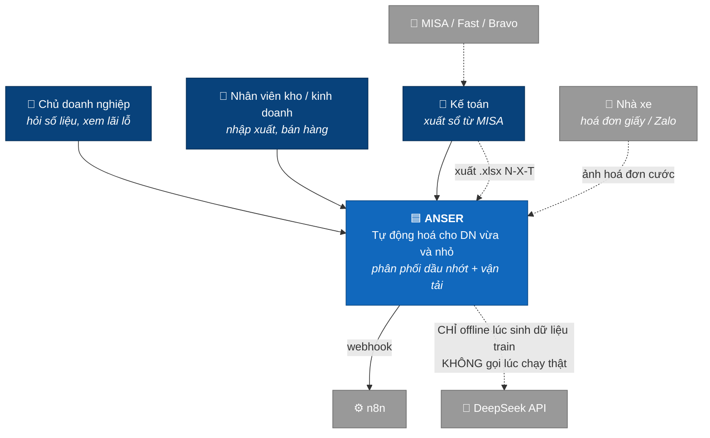
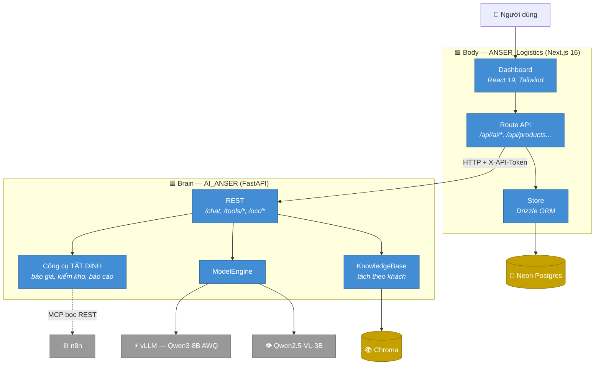
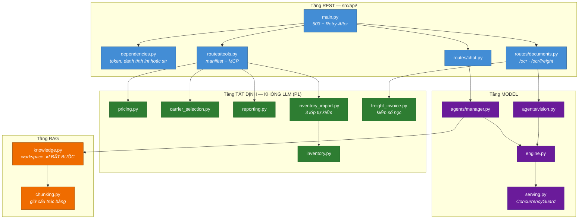
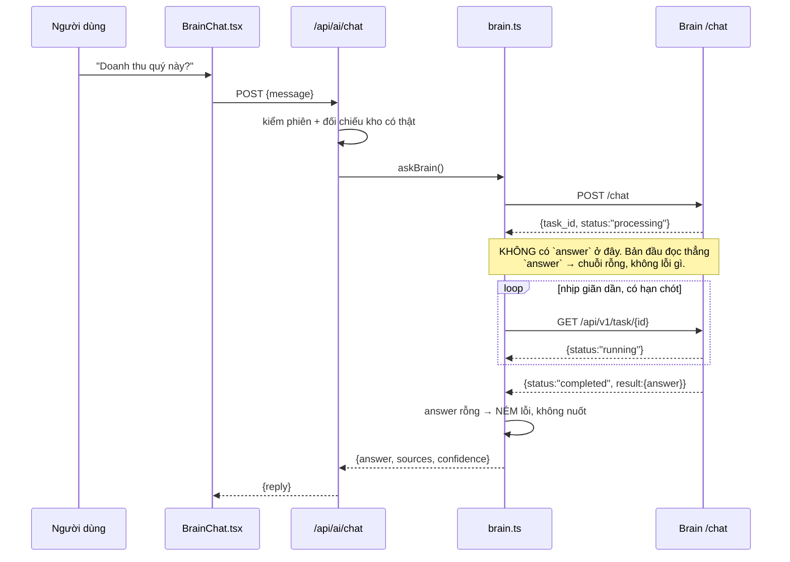
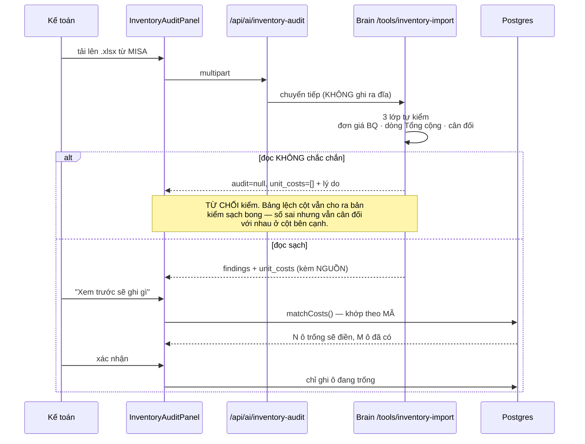
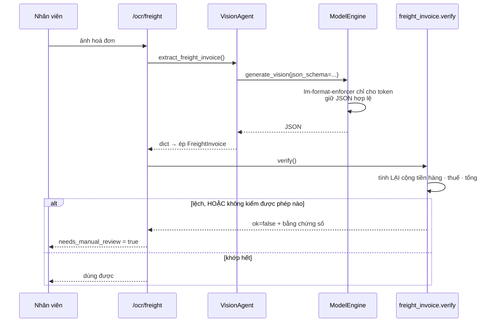
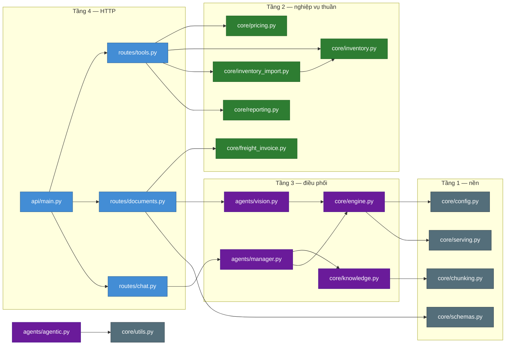
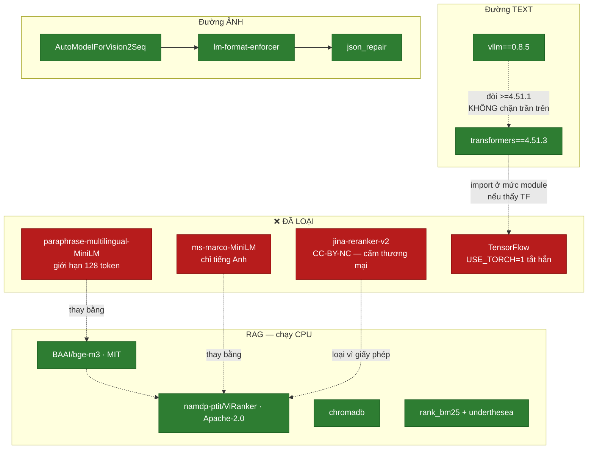
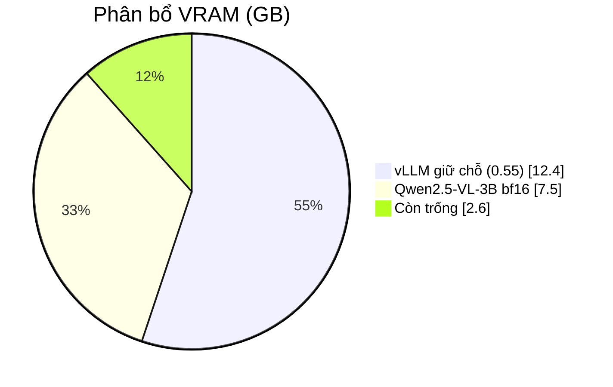
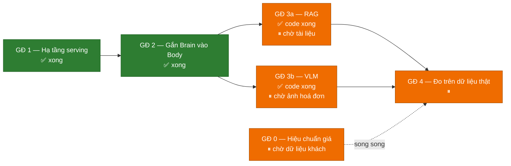

# ANSER — sơ đồ kiến trúc (C4)

Phụ lục hình vẽ cho [ARCHITECTURE.md](ARCHITECTURE.md). Tách file riêng vì
ARCHITECTURE.md đã 64KB; **quyết định kiến trúc vẫn nằm ở đó**, file này chỉ vẽ
lại cho dễ nhìn.

Vẽ tay từ code thật, cập nhật 03/08/2026. Mermaid nên xem thẳng được trên GitHub
và sửa cùng commit với code.

> **Vì sao vẽ tay:** Grapuco chưa index hai repo này (chỉ có 2 bản `PE_test`), và
> MCP của nó không có tool tự index — phải thêm repo từ giao diện Grapuco trước.
> Khi có index rồi thì dùng để **đối chiếu** với bản vẽ này chứ không thay thế:
> sơ đồ sinh tự động cho biết code *đang* thế nào, bản vẽ tay nói *vì sao* thế.

Đọc kèm: [RAG_VLM_KE_HOACH.md](RAG_VLM_KE_HOACH.md) ·
[HOANG_PHAT_DU_LIEU_CAN_XIN.md](HOANG_PHAT_DU_LIEU_CAN_XIN.md)

---

## Mức 1 — Bối cảnh

Điều đáng chú ý nhất: DeepSeek nối bằng nét đứt kèm ghi chú "không gọi lúc chạy
thật". Dữ liệu huấn luyện do nó sinh, nhưng khi khách dùng thì không byte số liệu
nào rời hạ tầng của mình (P2). Sổ kho lộ ra giá vốn từng mặt hàng — thứ nhạy cảm
nhất của một nhà phân phối.

---

## Mức 2 — Container

**Brain KHÔNG đọc cơ sở dữ liệu.** Mọi `/tools/*` là hàm thuần qua HTTP: dữ liệu
vào trong request, kết quả trong response. Body lấy dữ liệu rồi chuyển sang. Nhờ
vậy test không cần DB, và khi thuê GPU thì dữ liệu khách không nằm trên máy Brain.

**`/chat` là BẤT ĐỒNG BỘ** — trả `{task_id}` rồi chạy nền. Bản đầu của
`askBrain()` đọc thẳng `answer` từ phản hồi đó; trường ấy không tồn tại nên hàm
trả chuỗi rỗng mà không lỗi gì, UI hiện bong bóng trống. Chỉ chạy thật mới lộ ra.

---

## Mức 3 — Bên trong Brain

**Màu xanh lá là phần không có LLM.** Mọi con số tài chính do khối đó tính. LLM
chỉ làm hai việc: đọc câu tiếng Việt tự do thành tham số có cấu trúc, và diễn
giải kết quả thành lời.

---

## Luồng 1 — Hỏi đáp (chỗ suýt hỏng im lặng)

---

## Luồng 2 — Kiểm sổ kho và nạp giá vốn

Mặc định chỉ điền ô trống vì giá vốn dựng từ phiếu nhập là giá **theo lô**, còn
giá suy từ bảng tổng hợp là **bình quân cả kỳ**. Đè cái sau lên cái trước là đổi
số chính xác lấy số ước lượng.

---

## Luồng 3 — Đọc hoá đơn nhà xe

`ok` đòi **cả hai** vế: không sai lệch **và** đã thật sự kiểm được ít nhất một
phép. Thiếu vế sau thì một tấm ảnh mờ đọc ra rỗng sẽ hiện lên như hoá đơn sạch —
không phép kiểm nào thất bại vì chẳng có gì để kiểm.

---

## Phụ thuộc giữa các module Brain

**Mũi tên chỉ đi xuống** — và từ 03/08/2026 điều đó **kiểm được**, không còn là
lời hứa: [`tests/test_layering.py`](tests/test_layering.py) duyệt AST toàn bộ
`src/` và đỏ nếu có module nào import ngược tầng. Duyệt AST chứ không grep, vì
lỗi lần trước nằm trong **thân hàm** — grep theo dòng đầu file không thấy.

### Chuyện đã xảy ra: bản đầu của trang này khẳng định sai

Bản đầu viết "mũi tên chỉ đi xuống" trong khi `agents/agentic.py` (T3) đang
import `api/routes/chat.py` (T4) để dùng `_extract_json_block`. Tôi vẽ tay theo
trí nhớ về *thiết kế* nên đã khẳng định điều mình muốn đúng, không phải điều
đang đúng. Bản đồ Grapuco sinh tự động bắt được.

Đã sửa: hàm chuyển sang `core/utils.py` (nó chỉ đếm ngoặc trên một chuỗi, chẳng
liên quan gì HTTP), `chat.py` giữ alias cho 5 chỗ gọi cũ.

### Rà toàn repo: 1 thật trên 5 chỗ Grapuco báo

| Grapuco báo | Thực tế |
|---|---|
| `agentic.py` → `routes/chat.py` | ✅ **thật** — đã sửa |
| `core/integrations.py` → `core/memory.py` | ❌ tiêm phụ thuộc: `memory_manager` truyền vào `__init__` |
| `core/tools.py` → `core/memory.py` | ❌ tiêm phụ thuộc: `memory` là **tham số hàm** |
| `core/workflow_schema.py` → `agents/researcher.py` | ❌ trùng tên hàm `search`, không có tham chiếu nào |

Cạnh `CALLS` của phân tích tĩnh là **manh mối, không phải phán quyết**. Nó không
phân biệt được "gọi qua đối tượng được truyền vào" với "phụ thuộc cứng vào
module" — mà đó chính là ranh giới giữa thiết kế tốt và nợ kỹ thuật. Cạnh
`IMPORTS` thì đáng tin: cả hai lần nó báo đều đúng.

---

## Phụ thuộc ngoài — và vì sao chọn

### Ba ràng buộc version phải nhớ

| Ràng buộc | Không giữ thì sao |
|---|---|
| `transformers==4.51.3` | Bản 5.x bỏ `all_special_tokens_extended` → vLLM chết lúc dựng tokenizer |
| `USE_TORCH=1` | transformers import TensorFlow → xung đột protobuf → `import vllm` chết |
| Không khai `quantization="awq"` | vLLM bị ép xuống nhân chậm, và `dtype=auto` (bfloat16) đâm vào ràng buộc float16 |

---

## Ngân sách VRAM trên L4 22,5GB

`gpu_memory_utilization` là phần **giữ chỗ**, không phải phần dùng thật: 0,55
nghĩa là vLLM chiếm 12,4 GB kể cả khi weights chỉ 6 GB.

Cộng thêm `bge-m3` (~1,2 GB) và `ViRanker` (~1,2 GB) là **tràn**. Nên hai model
RAG chạy **CPU**: truy vấn RAG thưa (vài lượt mỗi phút, không phải mỗi token),
đổi ~200 ms độ trễ lấy 2,4 GB VRAM là hời — và nó cho phép Brain chạy trên máy
không GPU.

---

## Trạng thái các giai đoạn

**Cả bốn việc còn lại đều chặn ở DỮ LIỆU, không chặn ở code.** Xem
[HOANG_PHAT_DU_LIEU_CAN_XIN.md](HOANG_PHAT_DU_LIEU_CAN_XIN.md).
