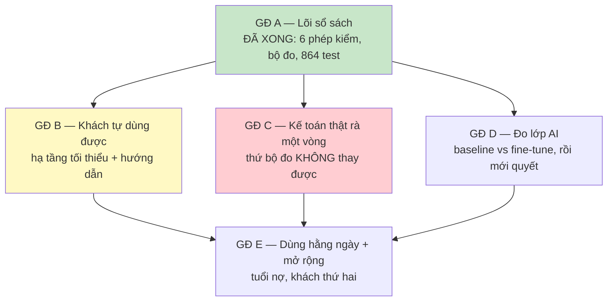

# ROADMAP — từ code đã có tới sản phẩm khách tự dùng được

**Viết lại 13/08/2026.** Bản trước (30/07) lập cho một sản phẩm **môi giới vận
tải**: báo giá cước, chọn nhà xe, và mọi thứ chặn ở Giai đoạn 0 — hiệu chỉnh
công thức giá trên 15–20 báo giá lịch sử.

Giai đoạn 0 đó **chưa bao giờ qua**, và giờ thì không cần qua nữa. Chú Hoàng Phát
nói thẳng trong tin nhắn 13/08:

> *"hiện tại công ty chú là **chuyên bán dầu**, chưa phải là công ty về vận tải"*

Trong khi đó, thứ đã chạy trên dữ liệu thật và ra kết quả khách kiểm tay được là
**kế toán và sổ sách** — không nằm trong bản roadmap cũ một dòng nào.

Bài học đắt nhất của hai tuần qua không phải kỹ thuật: **kế hoạch cũ chặn ở một
cánh cổng mà khách không có chìa, còn thứ tạo ra giá trị thì không có cổng nào
để biết là đủ hay chưa.** Bản này đảo lại cả hai.

---

## Hiện trạng — cái gì có bằng chứng, cái gì chưa

| Lớp | Trạng thái | Bằng chứng |
|---|---|---|
| **Kế toán / sổ sách** | 🟢 chạy thật, đo được | 864 test · 6 file MISA thật · 12/12 ca gieo lỗi, 0 báo oan |
| **Giao diện (Body)** | 🟢 chạy thật | 20/20 ca qua đúng luồng người dùng, có đăng nhập |
| **Nạp file .xlsx** | 🟢 chạy thật | 121+161+104+42 dòng đọc sạch, 0 cảnh báo |
| **RAG (kho tri thức)** | 🟡 có code, chạy được, chưa đo | 4 lỗ hổng cũ đã vá; chưa có bộ đo |
| **Lớp AI (chat, agentic)** | 🔴 **chưa có một con số nào** | benchmark chưa từng chạy xong |
| **VLM (đọc hoá đơn)** | 🔴 chưa đo | chưa có hoá đơn thật nào |
| **Hạ tầng triển khai** | 🔴 **viết xong, chưa chạy lần nào** | compose đủ; 3 phần khai báo rõ là chưa nối |
| **Báo giá / chọn nhà xe** | ⚫ tạm gác | khách không làm vận tải |

**Đọc kỹ dòng "lớp AI".** Tám commit gần đây toàn là *sửa công cụ đo*, chưa lần
nào *dùng* nó. Ta đang có một cái cân đã hiệu chỉnh rất kỹ mà chưa cân gì.

---

## Nguyên tắc xếp thứ tự (giữ nguyên, vì nó đúng)

**Việc nào sớm phát hiện được sai lầm đắt tiền nhất thì làm trước.**

Hai lần gần đây nó tự chứng minh:

* Chạy test nội bộ qua **HTTP thật** thay vì TestClient → lộ ra compose đặt sai
  tên biến token, và Brain triển khai theo README sẽ **không kiểm token nào** mà
  vẫn mở ra Internet.
* Dựng **bộ đo** cho lớp kế toán → lộ ra `allow_zero_value` là code chết, kho
  khuyến mại vẫn báo oan 29 dòng trên đường thật.

Không test đơn vị nào bắt được hai lỗi đó. Cả hai đều là "hai thứ đúng riêng lẻ,
sai khi ghép".

---

## Bức tranh phụ thuộc

`GĐ C` tô đỏ vì nó là điểm chặn **không gỡ được bằng code**.

---

## GĐ A — Lõi sổ sách ✅ XONG

Sáu phép kiểm chạy tất định, **không cần GPU, không cần DB, không cần model**
(đã xác nhận: `/health` 200 và `/tools/*` 200 với môi trường trống).

| Phép kiểm | Tìm ra gì trên sổ thật |
|---|---|
| Tồn kho | 2 mã âm; **5.596.500đ** giá vốn không được ghi |
| Đối chiếu hai kỳ | chứng từ bị **sửa hồi tố**, 108 lít chạy từ mã này sang mã kia |
| Thuế suất GTGT | **157/160 mã** đang để sai diện thuế theo NĐ 174/2025 |
| Công nợ | phải thu **3,96 tỷ** = 113 ngày giá vốn; 3 khách giữ **66%** |
| Mã số thuế | 114 mã kiểm được, **0 sai** — và 0 báo oan |
| Hàng chết | 29 mã, ~161 triệu nằm im |

**Cách đo (`offline_training/eval_ke_toan.py`):**

* **Sổ thật đã ẩn danh** → chốt mốc, báo khi kết quả **đổi**. Không ai biết chắc
  sổ có bao nhiêu lỗi, nên không chấm đúng/sai được ở đây.
* **12 ca gieo lỗi** vào chính sổ đó → đáp án biết trước, chấm bắt được / báo oan.
  Hiện **12/12 và 12/12**, nhưng n=12 nên khoảng tin cậy là **75,8%–100%**.

> Bộ đo tự nói ra giới hạn của nó. "12/12" không phải "100%".

---

## GĐ B — Khách tự dùng được 🟡 ĐANG LÀM

**Cổng ra:** kế toán của Hoàng Phát tự tải file lên, tự đọc kết quả, **không cần
ai ngồi cạnh**. Đây là cột mốc thật — đạt được thì sản phẩm có giá trị, mọi thứ
sau là làm tốt hơn.

| Việc | Trạng thái |
|---|---|
| Hai màn hình Dòng tiền + Cảnh báo sổ sách | ✅ chạy thật, 20/20 ca |
| Nạp file qua giao diện | ✅ 4 loại file MISA |
| Chạy trên máy mình | ✅ Brain 8000 + Body 3100 |
| **Đưa lên chỗ khách truy cập được** | ❌ chưa |
| **Hướng dẫn cho người không phải kỹ thuật** | ❌ chưa |
| Xoá file sau khi xử lý | ✅ file không ghi ra đĩa (P2) |

**Ba chỗ compose mô tả mà code chưa làm** — đã ghi thẳng trong file và khoá bằng
`tests/test_deploy_config.py`:

1. `redis` chạy nhưng không code nào dùng — `TASK_REGISTRY` vẫn trong RAM
2. `vllm-vision` chưa có client HTTP — vision vẫn nạp trong tiến trình
3. Vì (2), `brain` **không** chạy được bằng CPU như sơ đồ vẽ

Ba thứ này **không chặn GĐ B** nếu chỉ chạy phần kế toán: phần đó không cần model.

---

## GĐ C — Kế toán thật rà một vòng 🔴 CHẶN, KHÔNG GỠ ĐƯỢC BẰNG CODE

Bộ đo trả lời được *"code có làm đúng thứ ta định không"* và *"hôm nay có khác
hôm qua không"*. Nó **không** trả lời được *"cách hiểu nghiệp vụ của ta có đúng
không"* — vì đáp án của 12 ca gieo lỗi do chính chúng ta đặt.

Cụ thể ba chỗ đang tự khẳng định:

| Chỗ | Rủi ro nếu ta hiểu sai |
|---|---|
| Bảng tra thuế 8%/10% | Khách xuất hoá đơn sai thuế suất → truy thu + phạt |
| "Sửa hồi tố" | Cáo buộc sổ bị sửa mà thực ra là nghiệp vụ bình thường |
| Ngưỡng tập trung 20%/50% | Con số do ta đặt, chưa ai xác nhận là mức đáng lo |

**Việc cần:** một kế toán có nghề đọc [HOANG_PHAT_SOAT_SO_1108.md](HOANG_PHAT_SOAT_SO_1108.md)
và nói từng phát hiện là đúng hay sai. Một buổi là đủ.

---

## GĐ D — Đo lớp AI 🔴 CHƯA CÓ SỐ NÀO

Không có `baseline.json`, `tuned.json`, hay bất kỳ file kết quả benchmark nào
trong repo. Cổng "dùng bản fine-tune hay model gốc" **chưa từng được đưa ra**.

| Việc | Cần gì |
|---|---|
| Chạy một phiên Colab: baseline vs fine-tune | **một buổi của chủ dự án** |
| So theo cặp, không so hai con số trung bình | đã có `compare_runs.py` |
| Quyết: dùng fine-tune, hay model gốc, hay bỏ hẳn | có số rồi mới quyết |

**Đừng thuê GPU trước khi có số này.** Trả tiền hằng tháng cho một lớp chưa đo
bao giờ là cách nhanh nhất để tốn tiền vào thứ có thể không cần.

---

## GĐ E — Dùng hằng ngày + mở rộng

| Việc | Chặn bởi |
|---|---|
| **Tuổi nợ 30/60/90 ngày** | cần *Sổ chi tiết công nợ phải thu* — số dư hiện có không kèm ngày hoá đơn |
| Kiểm lại kho KHUYẾN MẠI | cần bản xuất đến 11/08 |
| Truy ra chứng từ bị sửa | cần sổ chi tiết 3 mã VT00039/VT00042/VT00023 |
| Thuế suất thực tế trên hoá đơn | cần 3–5 hoá đơn bán ra sau 01/7/2025 |
| Khách thứ hai | cần GĐ B + GĐ C xong |

Danh sách đầy đủ ở [HOANG_PHAT_DU_LIEU_CAN_XIN.md](HOANG_PHAT_DU_LIEU_CAN_XIN.md).

---

## Điểm chặn cần theo dõi

| # | Điểm chặn | Ai gỡ | Trạng thái |
|---|---|---|---|
| 1 | Sổ chi tiết công nợ (mở khoá tuổi nợ) | Khách | đã xin, chờ |
| 2 | Kế toán thật rà kết quả | Chủ dự án tìm người | **chưa bắt đầu** |
| 3 | Một buổi chạy Colab để đo model | Chủ dự án | chưa |
| 4 | Chỗ đặt để khách truy cập | Chủ dự án | chưa |
| 5 | Đội Body chốt schema mới | Đội Body | đã gửi `ERD_CHUAN.md` |

---

## Cái gì KHÔNG làm (và vì sao)

| Không làm | Lý do |
|---|---|
| **Hiệu chỉnh công thức báo giá cước** | Khách không làm vận tải. Code `pricing.py` + `carrier_selection.py` **giữ nguyên, có test**, nhưng **chưa hiệu chỉnh trên số thật của ai** nên chưa bán được cho ai |
| Thuê GPU lúc này | Phần kế toán không cần model. Đo xong GĐ D rồi tính |
| Nối Redis / vision HTTP | Chưa chặn gì. Đã khai báo rõ là chưa nối, có test canh |
| Text-to-SQL cho báo cáo | Số tài chính sai mà nghe hợp lý là loại lỗi tệ nhất |
| Đưa giá dầu vào RAG | Giá đổi hàng ngày; embedding cũ nằm lại và vẫn bị truy hồi ra |
| Fine-tune VLM | Chưa có một hoá đơn thật nào để đo |
| Đưa file MISA gốc vào repo | Chứa tên khách, MST, số nợ. Dùng bản ẩn danh — đã kiểm là cho kết quả y hệt |

---

## Nếu chỉ làm được ba việc

1. **Kế toán thật rà một vòng** (GĐ C) — thứ duy nhất không mua được bằng code
2. **Đưa lên chỗ khách bấm được** (GĐ B) — biến demo thành sản phẩm
3. **Một buổi Colab đo model** (GĐ D) — để biết có nên trả tiền GPU không

Ba việc này độc lập nhau, làm song song được.
