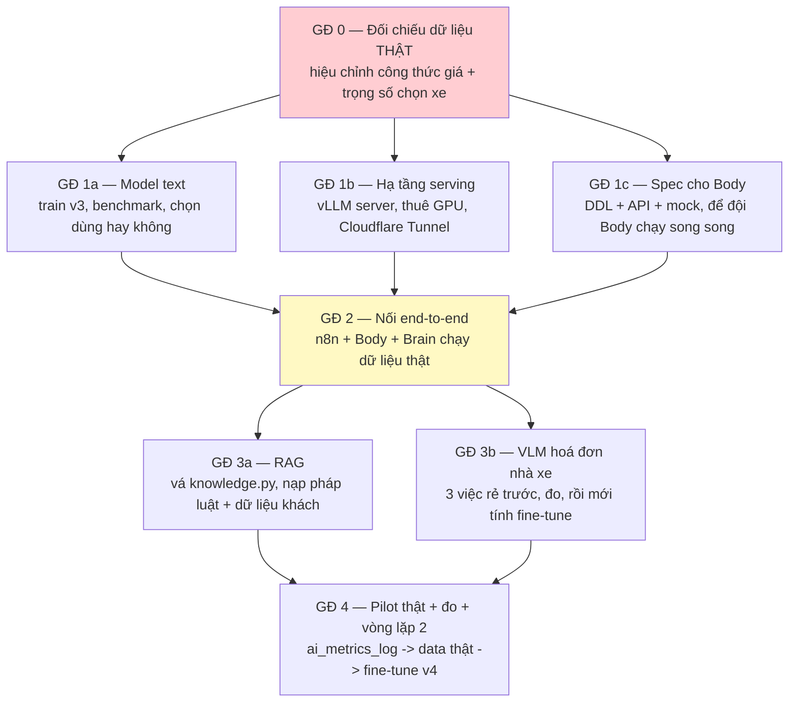

# ROADMAP — từ code đã có tới sản phẩm chạy thật với khách pilot

Lập 30/07/2026 theo 4 quyết định của chủ dự án: **mốc 2-3 tháng**, **thuê GPU
theo giờ**, **VLM có trong phạm vi** (khách nhập hoá đơn nhà xe), **đồng đội làm
Body**.

Tài liệu này nói *làm gì, theo thứ tự nào, vì sao thứ tự đó*.
Kiến trúc và lý do kỹ thuật nằm ở [ARCHITECTURE.md](ARCHITECTURE.md);
quy tắc làm việc ở [AGENTS.md](AGENTS.md).

---

## Nguyên tắc xếp thứ tự

**Việc nào sớm phát hiện được sai lầm đắt tiền nhất thì làm trước.**

Không phải "việc nào dễ nhất" hay "việc nào thú vị nhất". Cụ thể ở dự án này:
một công thức giá sai phát hiện ở tuần 10 sẽ kéo theo bỏ toàn bộ dữ liệu đo,
toàn bộ lần fine-tune, và niềm tin của khách. Cùng sai lầm đó phát hiện ở tuần 1
tốn một buổi ngồi với khách.

Hệ quả trực tiếp: **Giai đoạn 0 chặn mọi thứ khác**, dù nó không có dòng code nào.

---

## Bức tranh phụ thuộc

---

## Giai đoạn 0 — Đối chiếu dữ liệu thật (tuần 1) 🔴 CHẶN MỌI THỨ

**Không viết code. Không cần GPU.** Ngồi với khách và lấy số thật.

| Việc | Đầu ra | Vì sao |
|---|---|---|
| Lấy bảng giá thật 3-5 nhà xe đang dùng | `Carriers.csv` + `CarrierQuotes.csv` có dữ liệu | Toàn bộ engine chọn xe đang chạy trên số giả định |
| Lấy 15-20 báo giá lịch sử: giá nhà xe chào → giá đã chốt với khách | Bảng đối chiếu | **Chạy ngược qua `compute_quote`** để hiệu chỉnh `base_margin_pct`, `fuel_sensitivity`, `min_margin_amount` |
| Hỏi: "lần gần nhất anh chọn hãng ĐẮT HƠN — vì sao?" | Trọng số thật | 6 tiêu chí trong `carrier_selection.py` đang có trọng số do tôi đặt. Câu trả lời này cho trọng số đúng |
| Hỏi: hoá đơn nhà xe đến ở dạng gì — ảnh chụp, PDF, giấy? có lưu lại không? | Quyết định phạm vi VLM | Nếu có sẵn bản nhập tay tương ứng → **dữ liệu có nhãn miễn phí** cho GĐ 3b |
| Xem HTML thật trang giá PVOIL | Regex đúng | Đang là TODO trong `logistics_fuel_price_sync` |

**Cổng ra GĐ 0:** chạy `compute_quote` trên 15-20 ca lịch sử, sai lệch trung
bình so với giá khách đã chốt **< 5%**. Chưa đạt thì chỉnh công thức, chưa đi tiếp.

> Sai lầm cần tránh: coi đây là "việc hành chính làm sau". Đây là việc **duy nhất**
> xác nhận được sản phẩm giải đúng bài toán. Mọi thứ còn lại chỉ là kỹ thuật.

---

## Giai đoạn 1 — Ba nhánh chạy song song (tuần 2-4)

### 1a. Model text

| Việc | Ghi chú |
|---|---|
| Train v3 trên Colab | 1.417 mẫu, 7 nhánh, đã sẵn sàng |
| Benchmark baseline vs fine-tune | `benchmark_v3.py`; **đo baseline trước** |
| **Quyết định: dùng bản fine-tune hay model gốc** | Chênh lệch nhỏ thì dùng gốc, để dành tiền cho hạ tầng |

### 1b. Hạ tầng serving 🔴 khoảng trống lớn nhất hiện nay

Colab **cấm** phục vụ traffic (§4.4). Hiện **không có chỗ nào** để chạy Brain thật.

| Việc | Ghi chú |
|---|---|
| Thuê GPU theo giờ (RTX 3090/4090 24GB) | vast.ai hoặc RunPod, ~0,2-0,3 USD/giờ. Chạy giờ hành chính ≈ **750k/tháng** — bậc T0 |
| **Đổi `vllm.LLM` → vLLM chế độ server** | §5.4: `run_in_executor` đang **vô hiệu hoá continuous batching**. Đây là nguyên nhân trực tiếp của "quá tải, treo" |
| Cloudflare Tunnel thay ngrok | ngrok là SPOF, đổi URL mỗi lần restart |
| Docker Compose: vLLM + Brain + n8n + Chroma | Một lệnh dựng lại toàn bộ khi đổi máy thuê |
| Redis cho `TASK_REGISTRY` | Hiện in-memory, mất task khi restart |
| Hàng đợi có giới hạn (backpressure) | §11.5 mục 3 |

**Cổng ra 1b:** khởi động lại máy thuê từ số 0 bằng một lệnh, `/health` xanh,
`inference_latency_p95` ≤ 5.000ms dưới 5 request đồng thời.

### 1c. Spec cho đội Body

Viết **hợp đồng interface** để hai bên phát triển song song không chặn nhau:

| Việc | Đầu ra |
|---|---|
| DDL bảng logistics | `carriers`, `carrier_quotes`, `routes`, `pricing_rules`, `quote_drafts`, `receivables` |
| API xuất dòng bán + chi phí theo kỳ | Cấp số cho `/tools/report` — hiện `_build_report_context` trả "chưa nối được" |
| Kênh chat cho chủ DN | Body có UI chat chưa? Nếu chưa → Discord/Zalo ở pilot |
| **Mock server** | Để Brain test end-to-end không cần chờ Body xong |

⚠️ `pricing_rules` chứa biên lợi nhuận — **bảng nhạy cảm nhất hệ thống** (§10).
Spec phải nói rõ ai được đọc.

---

## Giai đoạn 2 — Nối end-to-end (tuần 4-6) 🟡 CỘT MỐC THẬT

Đây là lần đầu tiên có **một câu hỏi thật của người thật đi hết đường**.

| Việc | Cổng ra |
|---|---|
| Điền dữ liệu thật vào Google Sheet | 7 tab có số thật của khách |
| Chạy 4 workflow n8n với số thật | Cào giá dầu đúng; báo giá ra số hợp lý |
| Chủ DN nhắn thử 20 câu | Ghi lại **từng câu sai** vào `ai_metrics_log` |
| Luồng nháp → duyệt → gửi email | Chạy trọn vẹn, email đúng nội dung |

**Cổng ra GĐ 2:** chủ DN gửi được **một báo giá thật cho khách thật** qua hệ
thống, không cần ai can thiệp tay.

Đạt mốc này thì sản phẩm đã có giá trị — mọi thứ sau là làm tốt hơn.

---

## Giai đoạn 3 — RAG và VLM (tuần 6-10)

### 3a. RAG (thiết kế ở [§13b](ARCHITECTURE.md))

Chạy ở Brain. Bốn lỗ hổng của `knowledge.py` phải vá trước khi nạp dữ liệu thật:

1. **Cô lập theo `workspace_id`** — nghiêm trọng nhất; đa khách hàng thì dữ liệu khách A lọt sang khách B
2. **Trích dẫn nguồn** — `search()` đang trả chuỗi ghép, vứt metadata
3. **Hiệu lực theo thời gian** — nghị định hết hiệu lực đang ngang hàng bản thay thế
4. **Ingest tăng dần** — hiện nạp lại toàn bộ mỗi lần khởi động

Nguồn: **dữ liệu riêng của khách** (bảng giá, hợp đồng, lịch sử tuyến) +
**pháp luật vận tải**. Giá dầu/phí BOT **không** vào RAG — dùng tra cứu tại thời
điểm gọi.

### 3b. VLM — hoá đơn nhà xe

Khách cần nhập hoá đơn nhà xe → đây là **giá vốn**, chính là số mà
`reporting.build_report` đang thiếu. Nối được là báo cáo lãi lỗ mới có nghĩa.

**Ba việc rẻ làm trước, đo rồi mới tính fine-tune:**

| # | Việc | Chi phí |
|---|---|---|
| 1 | Bật `guided_json` cho nhánh OCR | Vài giờ, không tốn tiền |
| 2 | Mở rộng `InvoicePayload` theo `INVOICE_SYSTEM` + `InvoiceFieldValidator` | Bug §11.2 đang treo |
| 3 | Nâng Qwen2-VL-2B → Qwen2.5-VL-3B | +1,5GB VRAM, vẫn vừa ngân sách |

Rồi **đo trên 30-50 hoá đơn nhà xe thật** đã gán nhãn tay.

**Chỉ fine-tune VLM nếu** độ chính xác trường sau 3 việc trên vẫn < 90% **và**
có ≥300 hoá đơn có nhãn. Nếu khách không lưu hoá đơn cũ kèm bản nhập tay thì
nguồn nhãn khả dĩ là **hoá đơn tổng hợp** (render từ mẫu, biết trước giá trị) —
rẻ và vô hạn, nhưng lệch phân phối so với ảnh chụp điện thoại, nên phải trộn với
ảnh thật.

---

## Giai đoạn 4 — Pilot thật, đo, vòng lặp 2 (tuần 10-12)

| Việc | Ghi chú |
|---|---|
| Khách dùng hàng ngày | Thời gian miễn phí — đúng thoả thuận |
| `ai_metrics_log` thu thập câu hỏi thật | **Nguồn dữ liệu quý nhất** — câu của khách thật, không phải sinh giả lập |
| Đọc log hàng tuần, sửa nhánh yếu | Số liệu quyết định, không phải cảm nhận |
| Fine-tune v4 từ dữ liệu thật | Thay dần dữ liệu sinh bằng dữ liệu thật |

---

## Điểm chặn cần theo dõi

| # | Điểm chặn | Ai gỡ |
|---|---|---|
| 1 | Bảng giá + báo giá lịch sử của khách | Khách — **chặn GĐ 0** |
| 2 | Hoá đơn nhà xe ở dạng gì, có lưu không | Khách — quyết định phạm vi VLM |
| 3 | Máy thuê + Docker | Chủ dự án |
| 4 | Bảng logistics + API bên Body | Đội Body |
| 5 | Kênh chat cho chủ DN | Đội Body, hoặc dùng Discord/Zalo ở pilot |

---

## Cái gì KHÔNG làm (và vì sao)

Ghi ra để khỏi bị cuốn theo:

| Không làm | Lý do |
|---|---|
| Text-to-SQL cho báo cáo | Số tài chính sai mà nghe hợp lý là loại lỗi tệ nhất. Engine tất định `/tools/report` đã thay thế |
| Đưa giá dầu vào RAG | Giá đổi hàng ngày; embedding cũ nằm lại và vẫn bị truy hồi ra |
| Model lớn hơn 8B | Không còn chỗ cho vision. OCR hoá đơn là tính năng cốt lõi (§5.2) |
| Fine-tune VLM ngay | Chưa có nhãn, chưa đo baseline. Ba việc rẻ có thể đã đủ |
| Tự xây RAG thứ hai ở Body | `rag_service` là cổng DB, không phải RAG nghiệp vụ (§13b) |
| Colab phục vụ traffic thật | Vi phạm điều khoản dịch vụ (§4.4) |
